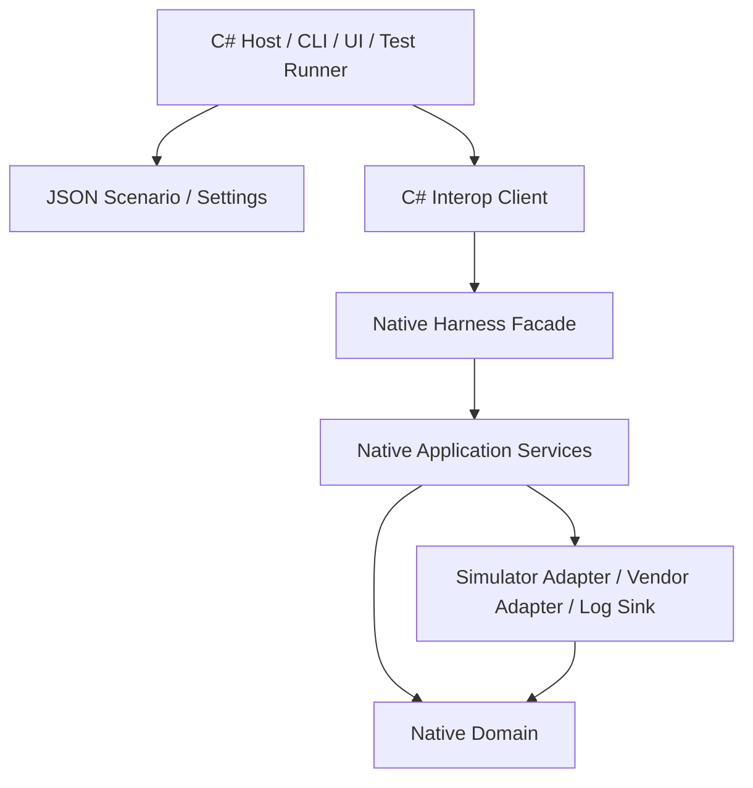
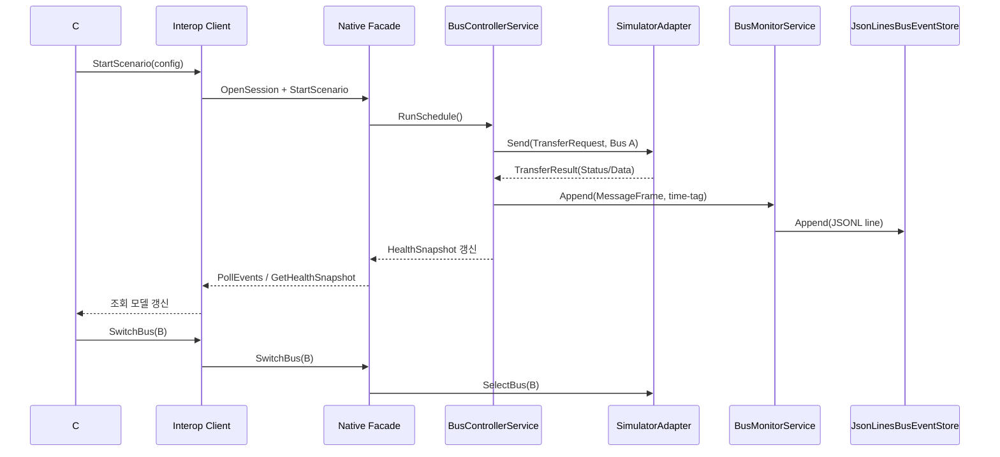

# 2026-04-17_전체하네스MVP_설계검토

## 1. 배경

- 현재 저장소는 템플릿과 안내 문서 중심으로만 준비되어 있고, 실제 구현 골격과 연속 작업 상태 문서는 아직 비어 있다.
- 이후 구현이 임시 구조로 흩어지지 않도록, 첫 사이클에서 전체 하네스 MVP의 기준선을 먼저 고정할 필요가 있다.
- `Agent_Plan_MIL_STD_1553B.md`는 전체 방향을 제시하지만, 실제 저장소 경로(`src/native`, `src/dotnet`, `tests/native`, `tests/dotnet`)와 바로 이어질 구현 단위까지는 한 번 더 구체화해야 한다.

## 2. 목표

- 시뮬레이터 우선 전체 하네스 MVP 범위를 확정한다.
- C++ 네이티브 계층과 C# 상위 계층의 책임 경계를 명확히 한다.
- 구현 단계에서 바로 사용할 수 있는 레이어 구조, 핵심 객체, 인터페이스, 데이터 흐름, TDD 출발점을 정의한다.

## 3. 범위

- 단일 채널 기준 BC / RT / BM 동시 지원
- 시뮬레이터 모드 우선 지원, 실장비 모드는 확장 포인트만 설계
- 타임아웃 감지, 단일 재시도, 자동 failover, 수동 Bus A/B 전환을 포함한 건강 상태 추적
- JSON 기반 시나리오 및 설정 로딩
- BM time-tag 기록, JSONL 영구 저장, Host 조회용 이벤트 스트림, Host report export, JSONL replay 최소 경로
- Command Word / Status Word / Data Word / 대표 Mode Code 확장과 RT ↔ RT 검증 규칙
- 운영자용 기본 실행 프로젝트로 `src/dotnet/MilStd1553.Cli` 기준 CLI 진입점
- `src/native`, `src/dotnet`, `tests/native`, `tests/dotnet`를 기준으로 한 구현 뼈대 정의

## 4. 제외 범위

- 특정 벤더 SDK 제품명, 함수명, 헤더 구조, 라이선스 제약 확정
- 자동 failover 임계치의 운영 환경별 세밀한 튜닝
- WPF / WinUI 기반 rich UI 설계와 구현
- 전체 인증/검증 체계와 표준 적합성 도구 완성
- 멀티채널, HIL, 장시간 soak test 자동화, 고급 replay 편집 기능

## 5. 요구사항

1. BC는 주기 스케줄에 따라 RT 질의와 RT ↔ RT 전송을 오케스트레이션할 수 있어야 한다.
2. RT 시뮬레이터는 서브어드레스별 데이터 매핑과 상태 워드 생성을 지원해야 한다.
3. BM은 모든 메시지를 time-tag와 함께 기록하고, JSONL 형식의 영구 저장 초안을 남기며, Host가 조회 가능한 이벤트로 노출해야 한다.
4. Host는 telemetry DTO와 health snapshot을 재해석하지 않고 받아서 JSONL 기반 실행 요약 보고서로 내보낼 수 있어야 한다.
5. Bus A/B 상태는 명시적으로 표현되어야 하며, line fault 또는 연속 timeout이 임계치를 넘으면 자동으로 standby bus로 failover 할 수 있어야 한다.
6. 타임아웃과 단일 재시도 결과는 오류 코드와 건강 상태에 반영되어야 한다.
7. 벤더 SDK 타입과 raw 버퍼는 C#에 직접 노출하지 않는다.
8. Domain 규칙은 시뮬레이터와 실장비 어댑터가 동일하게 재사용해야 한다.
9. 구현 시작 전 Red 테스트를 먼저 작성할 수 있을 정도로 인터페이스와 결과 타입이 명확해야 한다.
10. Host는 동일한 실행 결과를 JSONL / CSV / Markdown으로 내보낼 수 있어야 한다.
11. Host는 BM JSONL 로그를 읽어 telemetry DTO로 replay 할 수 있어야 한다.
12. Host는 시나리오 파일을 읽어 세션 시작, 선택적 Bus 전환, health/telemetry 출력 후 종료하는 CLI baseline을 제공해야 한다.
13. receive 계열 `MessageFrame` telemetry는 실제 bus payload를 보존해야 하고, RT ↔ RT는 source / destination 단계를 구분해 기록할 수 있어야 한다.
14. RT ↔ RT 목적지 단계는 시뮬레이터 baseline에서 source 완료 이후 최소 gap을 가진 time-tag로 정규화돼야 하며, 그 값은 result와 telemetry에 같은 기준으로 반영돼야 한다.

## 6. 용어 정의

| 용어 | 의미 |
| --- | --- |
| BC | Bus Controller. 버스 명령 흐름을 주도하는 주체이다. |
| RT | Remote Terminal. BC 명령에 따라 송수신하는 종단이다. |
| BM | Bus Monitor. 메시지를 관찰하고 time-tag와 함께 기록하는 감시자이다. |
| Bus A/B | 1553 이중화 버스 라인이다. MVP에서는 수동 전환을 우선 지원한다. |
| Simulator Adapter | 실장비 없이 BC / RT / BM 흐름을 재현하는 네이티브 어댑터이다. |
| Vendor Adapter | 실제 1553 카드 SDK를 감싼 네이티브 어댑터이다. |
| TransferRequest | 전송 의도, 버스 라인, 대상 RT/SA, 데이터 페이로드를 담는 요청 객체이다. |
| TransferResult | Status/Data 응답, time-tag, 오류 코드, 건강 상태 반영 결과를 담는 객체이다. |
| Health Snapshot | active bus, timeout, retry, degraded 상태를 묶은 런타임 상태 스냅샷이다. |
| Mode Code | 제어성 명령을 나타내는 특수 커맨드이다. MVP에서는 확장 가능한 처리 구조만 우선 확보한다. |

## 7. MIL-STD-1553B 영향 분석

- BC 영향
  BC는 스케줄 실행, Command Word 생성, RT ↔ RT 오케스트레이션, 타임아웃 및 재시도 판단의 기준점이 된다. 따라서 BC 실행 서비스는 C++ 네이티브 계층에 배치하고, C#은 시작/중지/조회 수준의 명령만 전달한다.
- RT 영향
  RT는 수신 명령 해석, 서브어드레스별 데이터 제공, 상태 워드 생성, Mode Code 응답을 담당한다. 시뮬레이터 RT와 실장비 RT가 같은 도메인 규칙을 공유해야 하므로, RT 동작 규칙도 C++ Domain/Application에 둔다.
- BM 영향
  BM은 전송 주체가 아니므로, 송수신 제어 로직과 분리된 기록 전용 흐름이 필요하다. time-tag, Host 조회용 이벤트 버퍼, JSONL 영구 저장 sink, export용 변환은 BM 전용 서비스와 sink로 분리한다.
- Report Export 영향
  Host 보고서는 텔레메트리 DTO를 다시 프로토콜 단위로 해석하지 않고 요약/직렬화만 담당해야 한다. 따라서 exporter는 `TelemetryEventRecord`, `BusHealthSnapshot`, `ScenarioDefinition`을 받아 JSONL summary line과 event line을 만드는 Application/Presentation 경계 서비스로 둔다.
- Command Word 영향
  RT 주소, T/R, Subaddress, Word Count, Mode Code 여부 해석은 구현 초기에 가장 먼저 고정해야 하는 규칙이다. 이 규칙은 시뮬레이터와 실장비 모두에서 동일해야 하므로 canonical codec을 네이티브 Domain에 둔다.
- Status Word 영향
  RT 상태 비트, 오류 상태, 응답 누락 표시는 Health Snapshot과 연결되어야 한다. 상태 워드 해석 결과는 Host 화면이 아니라 네이티브 런타임에서 먼저 의미화한 뒤 C#에 전달한다.
- Data Word 영향
  16비트 데이터 워드 배열은 버스 규칙상 순서 보존이 중요하므로, DTO 직렬화 이전에 네이티브 계층에서 길이와 개수 검증을 수행한다.
  receive 계열 `MessageFrame` telemetry는 `TransferResult.dataWords`가 아니라 실제 request payload를 기록해야 하며, RT ↔ RT 목적지 단계도 같은 규칙을 따른다.
  또한 RT ↔ RT 목적지 단계는 simulator baseline에서 source 단계 완료 이후 최소 gap을 갖도록 time-tag를 정규화한다.
- Mode Code 영향
  MVP에서는 전체 Mode Code 지원보다, no-data / with-data 구분과 미지원 응답 경로를 먼저 고정한다. 현재 기준 대표 Mode Code는 `Transmit Status Word`, `Transmit BIT Word`, `Synchronize`, `Synchronize With Data Word`, `Transmit Vector Word`와 1차 tranche `Reset Remote Terminal`, `Transmit Last Command Word`, `Inhibit Terminal Flag`, `Override Inhibit Terminal Flag`를 지원하고, 2차 묶음 이상은 동일한 규칙 테이블을 따라 붙일 수 있어야 한다.
- Bus A/B 전환 영향
  MVP에서는 수동 전환을 유지하되, 자동 failover는 `연속 timeout 2회` 또는 `line fault 1회`를 기준으로 standby bus로 전환한다. Health Snapshot은 active bus, standby bus, timeout, retry, 연속 timeout, 자동 failover 누적값을 반드시 포함해야 한다.

## 8. 책임 분리

### 8.1 C++ 책임

- Command Word / Status Word / Data Word / Message Frame 도메인 모델
- BC / RT / BM 런타임 서비스와 건강 상태 정책
- 시뮬레이터 어댑터와 벤더 어댑터 인터페이스
- time-tag 생성, 재시도 판단, 수동 버스 전환 반영
- C#이 사용할 세션/텔레메트리 중심 Native Facade 제공

### 8.2 C# 책임

- 시나리오/설정 편집 및 검증
- 세션 시작, 중지, 버스 전환, 오류 주입과 같은 상위 오케스트레이션
- 로그/텔레메트리 조회, 리포트 변환, CLI 또는 UI 표현
- 통합 테스트 실행기와 결과 요약
- 사용자 입력 검증과 환경별 구성 관리

### 8.3 공통 도메인 책임

- 교차 언어 경계는 벤더 타입이 없는 세션/텔레메트리 계약으로 제한한다.
- 프로토콜 의미화 규칙은 C++ Domain을 기준으로 유지하고, C#은 표시/직렬화용 DTO만 가진다.
- JSON 스키마, 오류 코드, Health Snapshot 필드는 버전 가능한 계약으로 정의한다.

## 9. 클린 아키텍처 레이어 영향도

| 레이어 | 책임 | 계획 위치 |
| --- | --- | --- |
| Domain | 워드/메시지/모드 코드/오류/건강 상태의 순수 규칙 | `src/native/Domain` |
| Application | BC / RT / BM 유스케이스, 스케줄, 재시도, 버스 전환, BM 기록 오케스트레이션 | `src/native/Application` |
| Infrastructure | 시뮬레이터 어댑터, 벤더 어댑터, 파일 로그, 시간 공급자, C ABI 노출 | `src/native/Infrastructure` |
| Presentation / Host | CLI/UI, 설정 편집, 세션 제어, 조회 모델, 리포트 | `src/dotnet/MilStd1553.Cli`, `src/dotnet/Host`, `src/dotnet/Interop` |

추가 메모:

- `src/dotnet/Interop`는 C# 관점에서 외부 런타임과 연결되는 Infrastructure Adapter 역할을 한다.
- `tests/native`는 Domain/Application 단위 테스트를 우선 수용하고, `tests/dotnet`은 Host 오케스트레이션과 설정 검증 테스트를 담당한다.

## 10. 객체 / 인터페이스 초안

### 10.1 핵심 객체

| 타입 | 역할 |
| --- | --- |
| `CommandWord` | RT 주소, 방향, 서브어드레스, 워드 수 또는 Mode Code를 표현하는 값 객체 |
| `StatusWord` | RT 상태 비트와 오류 표식을 담는 값 객체 |
| `DataWord` | 16비트 데이터 워드 값 객체 |
| `MessageFrame` | Command/Status/Data/time-tag를 하나의 프레임으로 묶는 기록 단위 |
| `TransferRequest` | 버스 라인, 대상 RT/SA, 방향, 데이터, 정책 옵션을 담는 요청 |
| `TransferResult` | 프레임, 오류 코드, retry 횟수, health 갱신 결과를 담는 응답 |
| `HealthSnapshot` | active bus, timeout 수, retry 수, 연속 timeout 수, 자동 failover 수, degraded 여부를 담는 상태 객체 |
| `ScenarioDefinition` | 주기 스케줄, RT 매핑, BM 설정, 버스 정책을 담는 시나리오 정의 |

### 10.2 네이티브 인터페이스

| 인터페이스 | 책임 |
| --- | --- |
| `IBusAdapter` | 채널 오픈/종료, BC/RT/BM 시작, 전송, 이벤트 수신, 버스 전환 |
| `ITransferScheduler` | 주기 스케줄 계산과 전송 트리거 |
| `IRtDataProvider` | RT 시뮬레이터용 서브어드레스 데이터 공급 |
| `IBusEventSink` | BM 기록과 Host 조회용 이벤트 축적 |
| `IBusEventStore` | BM 이벤트를 JSONL 같은 영구 저장 포맷으로 append |
| `AutomaticFailoverPolicy` | 연속 timeout과 line fault를 기준으로 standby bus 전환 여부를 판단 |
| `IScenarioRepository` | JSON 시나리오 읽기와 검증 결과 제공 |

### 10.3 추가 전송 객체

| 타입 | 역할 |
| --- | --- |
| `RtToRtTransferRequest` | 목적지 receive 커맨드와 소스 transmit 커맨드를 묶어 RT ↔ RT 흐름을 표현하는 요청 |
| `RtToRtTransferResult` | 소스 transmit 결과와 목적지 receive 결과를 함께 표현하는 응답 |
| `SimulatorBusAdapter` | RT 송수신 버퍼와 대표 Mode Code, 1차 Mode Code tranche를 재현하는 MVP용 Infrastructure 어댑터 |
| `VendorChannelConfiguration` | 실제 벤더 채널 open 시 필요한 공통 설정(channel, active bus, 역할 플래그, timeout)을 담는 설정 객체 |
| `VendorAdapterCapabilities` | BC/RT/BM, time-tag, line fault 지원 여부를 담는 capability 객체 |
| `VendorOperationResult` | open/close/select bus와 같은 채널 제어 결과를 담는 객체 |
| `VendorTransferResult` | 벤더 상태 코드, status/data/time-tag, 진단 문자열을 담는 전송 결과 객체 |
| `SimulatorVendorChannel` | `SimulatorBusAdapter`를 `IVendorChannel`로 감싸 concrete vendor binding 경로를 먼저 검증하는 Infrastructure 구현체 |

### 10.4 Host 및 Interop 인터페이스

| 인터페이스 | 책임 |
| --- | --- |
| `INativeHarnessClient` | C ABI 호출 래핑과 예외/오류 코드 변환 |
| `ISessionCoordinator` | 세션 시작/중지, 버스 전환, 오류 주입, 상태 조회 |
| `ITelemetryQueryService` | 최근 메시지, BM 기록, Health Snapshot 조회 |
| `IReportExporter` | 실행 결과를 JSON / CSV / Markdown으로 내보내기 |
| `ITelemetryReplayReader` | BM JSONL 로그를 telemetry DTO로 다시 읽어 Host에서 재생하기 |

추가 메모:

- Host 조회 모델은 프로토콜 규칙을 다시 해석하지 않도록 raw command/status word와 data word 배열을 텔레메트리 DTO로 유지한다.
- 초기 영구 저장 포맷은 line-by-line append가 쉬운 JSONL을 사용하고, Host는 같은 실행 결과를 JSONL / CSV / Markdown으로 직렬화한다.
- Host replay는 BM JSONL line을 `TelemetryEventRecord`로 역직렬화하는 최소 reader로 시작하고, 편집형 replay는 후속 범위로 둔다.

### 10.5 벤더 SDK 계약 구체화

| 인터페이스 / 타입 | 책임 |
| --- | --- |
| `IVendorChannel` | 실제 SDK channel/session open, close, transfer submit, bus select, capability query를 담당하는 가장 바깥 경계 |
| `IVendorErrorMapper` | 벤더 status code를 `Domain::ErrorCode`로 변환한다 |
| `DefaultVendorErrorMapper` | timeout / invalid word / line fault / unsupported mode code / adapter failure를 기본 매핑한다 |
| `VendorSdkBusAdapter` | `IVendorChannel`을 `Application::IBusAdapter`로 변환하는 Infrastructure adapter이다 |

추가 메모:

- `Application::IBusAdapter`는 유스케이스가 의존하는 최소 runtime 계약으로 유지하고, 채널 open/close/capability는 Infrastructure의 `IVendorChannel` 아래에 둔다.
- 실제 벤더별 함수명, 핸들 타입, callback 구조는 `IVendorChannel` 구현 내부에만 남기고 다른 계층으로 새지 않게 한다.
- 첫 concrete `IVendorChannel`은 `SimulatorVendorChannel`로 시작해 실제 SDK 정보 없이도 open/close/transfer/select bus 경로를 구조적으로 검증한다.
- `VendorSdkBusAdapter`는 lazy open을 허용해 현재 Application 흐름을 깨지 않으면서 실제 장비 경로를 붙일 수 있게 한다.
- open 이전 `SelectBus` 호출은 pending configuration만 갱신하고, open 이후에는 즉시 SDK channel select 호출로 전달한다.
- `Send`가 최초 호출될 때 channel이 아직 열리지 않았다면 `VendorSdkBusAdapter`가 `IVendorChannel::Open`을 먼저 시도하고, 실패 시 `AdapterFailure`로 변환한다.
- `SimulatorVendorChannel`은 channel의 selected bus를 별도 상태로 유지하고, `SubmitTransfer` 시 현재 selected bus를 권위 값으로 사용한다.

### 10.6 C# ↔ C++ 경계 원칙

- C#은 raw word 버퍼와 벤더 핸들을 직접 다루지 않는다.
- C ABI는 저수준 `SendWord` 중심이 아니라 세션/유스케이스 중심으로 노출한다.
- MVP 기준 C ABI 경계 함수는 `OpenSession`, `StopSession`, `SwitchBus`, `GetHealthSnapshot`, `PollTelemetry`로 제한한다.
- `PollTelemetry`는 Host DTO에 직접 매핑 가능한 텔레메트리 이벤트 목록을 반환하고, raw binary frame dump 대신 JSONL 저장 포맷과 동일한 의미 단위를 공유한다.
- 초기 C ABI payload는 caller-allocated UTF-16 버퍼에 JSON 문자열을 써 주는 방식으로 시작한다.
- `BufferTooSmall`가 반환될 때는 각 출력 버퍼의 필요 길이(널 종료 포함)를 out parameter로 함께 돌려준다.
- `OpenSession`은 native 세션 내부에서 `BusMonitorService`, `SimulatorVendorChannel`, `VendorSdkBusAdapter`, `BusControllerService`를 조립하고, 시나리오의 BC schedule을 한 번 순회하는 deterministic 초기 pass를 수행한다.
- 초기 pass에서 생성된 `MessageFrame` telemetry는 첫 `PollTelemetry` 호출 전까지 pending 상태로 유지되어 Host / CLI smoke test가 실제 메시지 경로를 검증할 수 있어야 한다.
- `PollTelemetry`는 pending telemetry 이벤트를 JSON 배열로 반환하고, 성공 반환 후 세션의 pending 이벤트를 비운다.
- Host 로더 경계는 `DllImport` 기본 검색에 의존하지 않고, `runtimes/win-x64/native/MilStd1553.Native.dll`를 기준으로 명시적인 런타임 경로를 계산해 `NativeLibrary.Load`로 적재한다.
- 테스트는 `MILSTD1553_NATIVE_RUNTIME_ROOT` 환경 변수를 통해 런타임 루트를 임시 폴더로 바꿔 누락, 잘못된 바이너리, 엔트리 포인트 불일치 시나리오를 재현한다.
- explicit runtime loader가 적재한 라이브러리 핸들은 resolved path 기준 프로세스 공유 캐시에 보관하고, 같은 경로는 재적재하지 않는다.
- MVP 기준 Host는 성공 적재된 라이브러리를 명시적으로 unload 하지 않으며, 실제 해제는 프로세스 종료 또는 테스트 전용 cache dispose 경로에서만 수행한다.

## 11. 데이터 흐름 / 시퀀스

### 11.1 계층 흐름



### 11.2 BC → RT 기본 시퀀스



### 11.3 세션 중심 C ABI 초안

```text
MilStd1553_OpenSession(
    scenarioJson,
    sessionHandleBuffer,
    sessionHandleCapacity,
    requiredSessionHandleCapacity,
    healthJsonBuffer,
    healthJsonCapacity,
    requiredHealthJsonCapacity)

MilStd1553_StopSession(sessionHandle)
MilStd1553_SwitchBus(sessionHandle, busLine)
MilStd1553_GetHealthSnapshot(
    sessionHandle,
    healthJsonBuffer,
    healthJsonCapacity,
    requiredHealthJsonCapacity)
MilStd1553_PollTelemetry(
    sessionHandle,
    telemetryJsonBuffer,
    telemetryJsonCapacity,
    requiredTelemetryJsonCapacity)
```

추가 메모:

- 첫 초안은 raw struct array보다 JSON payload가 변경 내성을 확보하기 쉽고, Host DTO/문서/테스트와 shape를 맞추기 쉽다.
- 버퍼 부족, 세션 없음, 잘못된 인자 같은 오류는 정수 status code로 반환하고, Host Interop가 이를 예외나 실패 코드로 변환한다.
- `required*Capacity` 값은 널 종료를 포함한 문자 수 기준이며, `BufferTooSmall`가 반환돼도 다음 재시도에 필요한 정확한 길이를 알 수 있어야 한다.
- `OpenSession`은 세션 핸들 버퍼와 health JSON 버퍼가 모두 충분할 때만 세션을 실제로 생성한다.
- `PollTelemetry`는 `BufferTooSmall`로 실패하면 pending telemetry를 유지하고, 성공했을 때만 clear 한다.
- Host `NativeHarnessClient`는 기본 버퍼 크기로 먼저 호출하고, `BufferTooSmall`가 오면 native가 돌려준 필요 길이로 버퍼를 재할당한 뒤 제한된 횟수 내에서 재시도한다.
- Host 런타임 로더는 `MilStd1553.Native.dll` 적재 시 `LibraryNotFound`, `InvalidBinary`, `EntryPointMissing`를 구분해 예외로 변환한다.
- 제품 기준 DLL 배치 경로는 `AppContext.BaseDirectory/runtimes/win-x64/native/MilStd1553.Native.dll`로 고정하고, 테스트는 같은 레이아웃을 임시 루트에 재현한다.
- 운영자용 기본 실행 루트는 `src/dotnet/MilStd1553.Cli`로 고정하고, `dotnet build` 또는 `dotnet publish` 1회로 `MilStd1553.Cli.exe`(또는 `MilStd1553.Cli.dll`), `MilStd1553.Interop.dll`, `MilStd1553.Host.dll`, `MilStd1553.Native.dll`가 같은 출력 루트 아래에 배치되도록 한다.
- `src/dotnet/MilStd1553.Interop`는 라이브러리 packaging 진입점으로 유지하되, README와 smoke test 기준점은 CLI 루트를 우선 사용한다.
- native DLL은 로더 규칙과 일치하도록 출력 루트 내부 `runtimes/win-x64/native`에 자동 배치하고, 사용자는 별도 수동 복사 없이 한 번의 build/publish 결과만 사용한다.
- 저장소의 운영자 진입 문서는 루트 `README.md`로 고정하고, 이 문서에는 사전 준비, one-shot packaging 명령, .NET / 네이티브 테스트 명령, 결과 DLL 위치를 함께 적는다.

## 12. TDD 계획

### 12.1 Red

- `tests/native`에 `CommandWord`, `StatusWord`, `DataWord`, `HealthSnapshot` 규칙 테스트를 먼저 작성한다.
- `BusControllerService`가 timeout 발생 시 `HealthSnapshot`을 degraded로 바꾸고 단일 재시도를 기록하는 실패 테스트를 작성한다.
- 수동 Bus A/B 전환 명령이 active bus를 갱신하고 이벤트를 남기는 실패 테스트를 작성한다.
- `BusMonitorService`가 time-tag와 함께 메시지를 저장하는 실패 테스트를 작성한다.
- `BusMonitorService`가 time-tag와 함께 메시지를 저장하고 JSONL sink에 append하는 실패 테스트를 작성한다.
- `SimulatorBusAdapter`가 RT → BC, RT ↔ RT, `Transmit Status Word`, `Transmit BIT Word`를 재현하는 실패 테스트를 작성한다.
- `tests/dotnet`에 잘못된 JSON 시나리오가 Host 단계에서 거부되는 실패 테스트를 작성한다.
- `tests/dotnet`에 활성 세션 없이 telemetry poll이 차단되고, 활성 세션에서는 native client의 텔레메트리 DTO를 그대로 반환하는 실패 테스트를 작성한다.
- `tests/dotnet`에 JSONL report exporter가 summary line과 event line을 생성하고, 빈 telemetry일 때 summary만 남기는 실패 테스트를 작성한다.
- `tests/native`에 세션 중심 C ABI가 open / switch / get health / poll telemetry를 처리하는 실패 테스트를 작성한다.
- `tests/native`에 `BufferTooSmall` 시 필요 버퍼 길이를 돌려주고, `PollTelemetry` pending 이벤트를 유지하는 실패 테스트를 추가한다.
- `tests/native`에 timeout 2회 후 자동 failover, line fault 1회 후 standby bus 재시도, 1차 Mode Code tranche, RT ↔ RT 검증 실패를 다루는 실패 테스트를 추가한다.
- `tests/dotnet`에 `NativeHarnessClient`가 scenario를 JSON으로 직렬화하고, native JSON payload를 Host DTO로 매핑하는 실패 테스트를 작성한다.
- `tests/dotnet`에 `NativeHarnessClient`가 `BufferTooSmall` 응답을 받으면 필요 길이로 버퍼를 재할당해 `OpenSession`, `GetHealthSnapshot`, `PollTelemetry`를 재시도하는 실패 테스트를 추가한다.
- `tests/dotnet`에 네이티브 DLL을 실제로 빌드해 `runtimes/win-x64/native` 레이아웃으로 배치한 뒤 `NativeHarnessClient`를 호출하는 smoke test를 작성한다.
- `tests/dotnet`에 런타임 DLL 누락, 잘못된 바이너리, 엔트리 포인트 불일치 케이스를 추가해 로더 경계가 `NativeLibraryLoadException`으로 실패를 드러내는지 검증한다.
- `tests/dotnet`에 `dotnet build src/dotnet/MilStd1553.Interop/MilStd1553.Interop.csproj -o <temp>` 실행 후 출력 루트에 managed DLL 2종과 runtime layout native DLL이 함께 생성되는 packaging 테스트를 추가한다.
- `tests/dotnet`에 `dotnet publish` 기준 출력도 같은 레이아웃을 유지하는지 검증한다.
- `tests/dotnet`에 동일한 런타임 DLL 경로를 여러 번 요청해도 로더가 한 번만 적재하고 즉시 free 하지 않는 cache 테스트를 추가한다.
- `tests/dotnet`에 테스트 전용 cache dispose가 캐시된 라이브러리 핸들을 한 번만 해제하는지 검증한다.
- `tests/dotnet`에 `HarnessCliRunner`가 시나리오 파일 읽기, 세션 시작, 선택적 Bus 전환, telemetry 출력, 세션 종료를 한 번의 흐름으로 수행하는 실패 테스트를 추가한다.
- `tests/dotnet`에 `dotnet build/publish src/dotnet/MilStd1553.Cli/MilStd1553.Cli.csproj -o <temp>` 실행 후 CLI 실행 파일과 managed/native DLL이 함께 생성되는 packaging 테스트를 추가한다.
- `tests/native`에 `VendorSdkBusAdapter`가 lazy open, capability query, vendor status code 매핑, open 이후 bus select forwarding을 수행하는 실패 테스트를 추가한다.
- `tests/native`에 `SimulatorVendorChannel`이 open 전 호출을 거부하고, open configuration의 initial bus와 이후 select bus를 실제 전송 경로에 반영하는 실패 테스트를 추가한다.
- `tests/native`에 `VendorSdkBusAdapter`가 `SimulatorVendorChannel` concrete 구현과 함께 lazy open 성공 경로를 통과하는 실패 테스트를 추가한다.
- `tests/dotnet`에 CSV / Markdown exporter와 JSONL replay reader가 동일한 telemetry 의미를 유지하는 실패 테스트를 추가한다.

### 12.2 Green

- 시뮬레이터 어댑터 기준 최소 동작만 구현한다.
- BC 주기 실행, RT 기본 응답, BM 기록, 수동/자동 버스 전환, Health Snapshot 갱신, RT ↔ RT 검증, 대표 Mode Code 5종과 1차 tranche 4종을 먼저 통과시킨다.
- Host는 세션 시작/중지/조회/버스 전환의 얇은 흐름과 JSONL / CSV / Markdown report export, JSONL replay 최소 경로를 연결한다.

### 12.3 Refactor

- 벤더 어댑터와 시뮬레이터 어댑터가 공유하는 공통 정책을 Application/Infrastructure 경계로 재정리한다.
- 오류 코드 변환과 DTO 매핑을 전용 mapper로 분리한다.
- BM 기록 저장 경로와 Host 조회 모델을 분리하고, replay/export가 같은 telemetry DTO를 재사용하도록 정리한다.
- 벤더별 SDK 래퍼는 `IVendorChannel` 구현으로만 추가하고 `VendorSdkBusAdapter`는 공통 bridge로 유지한다.
- `SimulatorVendorChannel`은 실제 벤더 SDK binding 이전의 기준 구현체로 유지하고, 이후 실장비 binding은 같은 `IVendorChannel` 계약만 구현한다.

## 13. 테스트 전략

- 정상 흐름
  BC → RT 상태 요청, RT → BC 데이터 송신, RT ↔ RT 전송, BM time-tag 기록을 검증한다.
- 비정상 흐름
  잘못된 서브어드레스, 미지원 Mode Code, 데이터 길이 불일치, 세션 미초기화 상태 호출을 검증한다.
- 타임아웃
  RT 무응답, 늦은 응답, timeout 이후 degraded 전이를 검증한다.
- 재시도
  단일 재시도 후 성공, 단일 재시도 후 실패, retry 카운트 누적을 검증한다.
- Bus A/B 전환
  수동 전환 성공, 자동 failover 성공, 전환 이후 active bus 반영, BM 로그의 bus 라벨 기록을 검증한다.
- 오류 주입
  시뮬레이터에서 응답 누락, 잘못된 상태 워드, line fault를 주입해 Health Snapshot과 이벤트 출력이 일치하는지 검증한다.

## 14. 리스크 및 대응

| 리스크 | 영향 | 대응 |
| --- | --- | --- |
| 벤더 SDK 미확정 | 실장비 어댑터 구조가 흔들릴 수 있다. | Vendor Adapter를 `IBusAdapter` 뒤에 가두고, 시뮬레이터 우선으로 진행한다. |
| 벤더 중립 계약이 너무 추상적 | 실제 SDK 연결 시 재작업이 생길 수 있다. | channel open/close, transfer submit, bus select, status code mapping처럼 공통성이 높은 최소 경계만 먼저 고정한다. |
| C#과 C++ 책임 혼합 | Host가 프로토콜 규칙을 중복 구현할 수 있다. | 세션/텔레메트리 중심 경계만 허용하고, 의미화 규칙은 네이티브에 둔다. |
| 자동 failover 오탐지 | 정상적인 일시 timeout에도 bus가 불필요하게 전환될 수 있다. | `연속 timeout 2회` 또는 `line fault 1회`로 임계치를 단순화하고, 이후 운영 튜닝은 backlog로 남긴다. |
| 물리 계층 문제를 시뮬레이터로만 판단 | 실장비 이슈를 늦게 발견할 수 있다. | 로그 포맷과 어댑터 경계를 먼저 고정해 실장비 연결 시 교체 범위를 줄인다. |
| BM 로그 과다 적재 | Host 성능과 저장소 포맷이 빠르게 복잡해질 수 있다. | 이벤트 스트림과 영구 저장을 분리하고, export 포맷 최적화는 후순위로 둔다. |

## 15. 완료 기준

- 설계 범위가 시뮬레이터 우선 MVP 기준으로 고정되어 있다.
- C++ / C# 책임 경계와 세션 기반 Interop 원칙이 문서화되어 있다.
- `src/native`, `src/dotnet`, `tests/native`, `tests/dotnet` 기준의 구현 방향이 명확하다.
- Red 테스트 출발점과 최소 Green 범위가 정의되어 있다.
- Bus A/B, timeout, retry, 자동 failover, BM 기록, Mode Code 확장 포인트가 설계에 반영되어 있다.
- 후속 구현과 deferred work가 상태 문서에 기록되어 있다.
