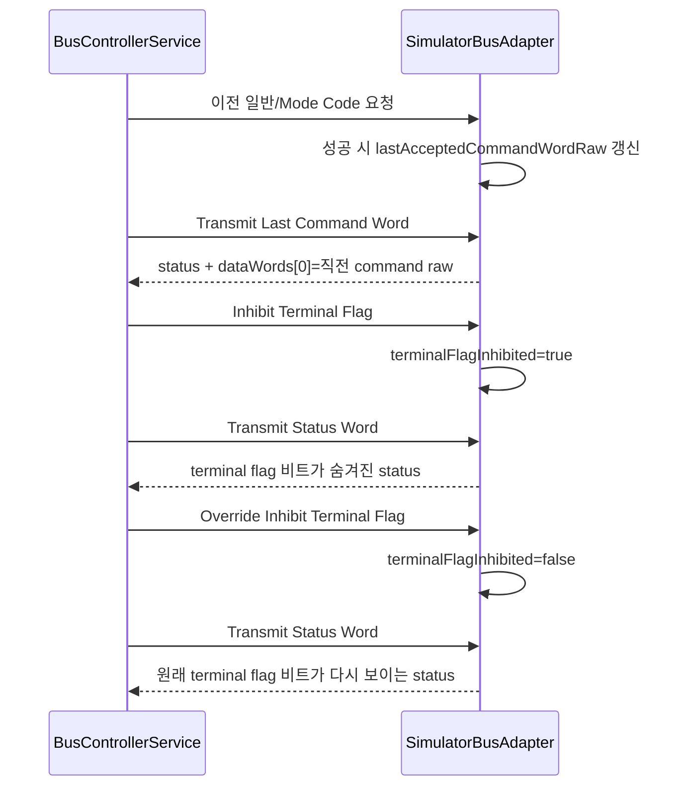

# 2026-04-18_ModeCode-tranche1_설계검토

## 1. 배경

- 현재 네이티브 시뮬레이터는 대표 Mode Code 5종만 지원하고 나머지는 `UnsupportedModeCode`로 거부한다.
- 잔여 확장 설계 문서에서는 외부 정보 없이 바로 진행할 다음 구현 단위로 1차 Mode Code 묶음 4종을 확정했다.
- 이번 작업은 실장비 binding이나 Host schema 변경 없이, 시뮬레이터 RT 상태 모델만 확장해 Mode Code 동작 규칙을 늘리는 최소 슬라이스다.

## 2. 목표

- 다음 4개 Mode Code를 시뮬레이터와 네이티브 테스트 기준으로 지원한다.
  - `Reset Remote Terminal`
  - `Transmit Last Command Word`
  - `Inhibit Terminal Flag`
  - `Override Inhibit Terminal Flag`
- 기존 대표 5종, RT ↔ RT 검증, Bus A/B 전환, CLI / Host 경계는 그대로 유지한다.
- 2차 묶음(`Dynamic Bus Control` 등)은 여전히 `UnsupportedModeCode`로 남긴다.

## 3. 범위

- `src/native/Domain/BusTypes.h`
- `src/native/Infrastructure/SimulatorBusAdapter.h`
- `src/native/Infrastructure/SimulatorBusAdapter.cpp`
- `tests/native/NativeTests.cpp`
- 관련 설계 / 테스트 / 상태 문서

## 4. 제외 범위

- C ABI 또는 Host 시나리오 JSON 스키마 변경
- 실제 벤더 SDK binding
- 2차 Mode Code 묶음 구현
- RT ↔ RT planner / policy 도입

## 5. 용어 정의

| 용어 | 의미 |
| --- | --- |
| 1차 Mode Code 묶음 | 외부 정보 없이 바로 구현할 4개 Mode Code 집합 |
| 마지막 커맨드 워드 | RT가 성공적으로 수락한 직전 커맨드 워드 raw 값 |
| terminal flag inhibit | RT 내부에 저장된 terminal flag 비트를 상태 워드 응답에서 일시적으로 숨기는 상태 |
| 기본 RT 상태 | 서브어드레스 데이터 없음, `bitWord=0`, `vectorWord=0`, 추가 inhibit 없음, 상태 워드 플래그 없음 |

## 6. 요구사항

1. `ModeCode` enum은 1차 묶음 4종을 표현할 수 있어야 한다.
2. `SimulatorBusAdapter`는 RT별로 “마지막 성공 커맨드 워드”를 기억해야 한다.
3. `Transmit Last Command Word`는 현재 요청 직전의 마지막 성공 커맨드 워드를 데이터 워드 1개로 반환해야 한다.
4. 직전 성공 커맨드가 없으면 `Transmit Last Command Word`는 `InvalidWord`로 실패한다.
5. `Inhibit Terminal Flag`는 RT 내부 상태를 바꿔 이후 상태 워드 응답에서 terminal flag 비트를 숨겨야 한다.
6. `Override Inhibit Terminal Flag`는 숨김 상태를 해제해 이후 상태 워드 응답에 원래 terminal flag 비트가 다시 보이게 해야 한다.
7. `Reset Remote Terminal`은 RT 상태를 기본 RT 상태로 되돌리고, 이후 요청부터 기본 상태로 동작해야 한다.
8. `Reset Remote Terminal` 이후 현재 요청 자체는 성공으로 끝나되, 이후 `Transmit Last Command Word`의 기준은 방금 수락된 reset command가 된다.
9. line fault, 일반 transmit / receive, 기존 대표 Mode Code 5종은 regress 되면 안 된다.
10. 2차 묶음 예시인 `Dynamic Bus Control`은 계속 `UnsupportedModeCode`로 반환되어야 한다.

## 7. 책임 분리

### 7.1 C++

- Mode Code 값 추가는 `Domain`
- RT 내부 상태와 Mode Code 처리 규칙은 `Infrastructure::SimulatorBusAdapter`
- 테스트 검증은 `tests/native`

### 7.2 C#

- 이번 작업에서는 변경 없음
- Host / CLI는 네이티브 의미 모델을 그대로 재사용한다.

## 8. 레이어 영향도

| 레이어 | 영향 |
| --- | --- |
| Domain | `ModeCode` enum 확장 |
| Application | 변경 없음 |
| Infrastructure | RT 내부 상태 모델과 Mode Code 처리 분기 확장 |
| Host / Interop | 변경 없음 |

## 9. 클래스 / 인터페이스 설계 초안

### 9.1 `ModeCode`

- 다음 4개 값을 추가한다.
  - `InhibitTerminalFlag`
  - `OverrideInhibitTerminalFlag`
  - `ResetRemoteTerminal`
  - `TransmitLastCommandWord`

### 9.2 `SimulatorBusAdapter::RemoteTerminalState`

- 기존 RT 상태에 아래 필드를 추가한다.
  - `std::optional<std::uint16_t> lastAcceptedCommandWordRaw`
  - `bool terminalFlagInhibited`

### 9.3 `SimulatorBusAdapter`

- effective status word를 계산하는 private helper를 둔다.
- 마지막 성공 커맨드 raw 값을 기록하는 private helper를 둔다.
- `ResetRemoteTerminal`이 RT 상태를 기본값으로 돌리는 private helper를 둔다.

## 10. 데이터 흐름

## 11. 테스트 전략

### 11.1 Red

- 직전 성공 커맨드가 있을 때 `Transmit Last Command Word`가 그 raw 값을 돌려주는 실패 테스트를 추가한다.
- 직전 성공 커맨드가 없을 때 `Transmit Last Command Word`가 `InvalidWord`로 실패하는 테스트를 추가한다.
- `Inhibit Terminal Flag` 이후 `Transmit Status Word`에서 terminal flag가 숨겨지는 실패 테스트를 추가한다.
- `Override Inhibit Terminal Flag` 이후 terminal flag가 다시 보이는 실패 테스트를 추가한다.
- `Reset Remote Terminal` 이후 서브어드레스 데이터, synchronize word, status bit가 기본 상태로 돌아가는 실패 테스트를 추가한다.
- `Dynamic Bus Control`이 여전히 `UnsupportedModeCode`인지 확인하는 회귀 테스트를 추가한다.

### 11.2 Green

- RT 내부 상태를 최소한으로 확장하고 `HandleModeCommand` 분기만 보강한다.
- 성공한 요청만 마지막 커맨드 raw 값으로 기록한다.

### 11.3 Refactor

- status word 응답 경로가 모두 같은 effective status helper를 사용하도록 정리한다.
- reset과 command recording을 helper로 분리해 mode 분기 중복을 줄인다.

## 12. 리스크 및 대응

| 리스크 | 영향 | 대응 |
| --- | --- | --- |
| terminal flag inhibit 의미를 단순 비트 토글로 구현하면 상태 의미가 흐려질 수 있다. | 나중에 실장비와 해석 차이가 생길 수 있다. | 저장된 원본 status word와 노출용 effective status를 분리해 “숨김 상태”로 모델링한다. |
| 마지막 커맨드 기록 시점이 잘못되면 `Transmit Last Command Word`가 자기 자신을 반환할 수 있다. | 모드 코드 의미가 틀어진다. | handler 실행 전 이전 값으로 응답을 만들고, 성공 반환 후 마지막에 현재 커맨드를 기록한다. |
| reset이 상태를 과도하게 지우면 기존 테스트가 깨질 수 있다. | simulator regression이 생긴다. | reset 범위를 기본 RT 상태로 문서화하고 관련 회귀 테스트를 함께 둔다. |

## 13. 완료 기준

- 1차 Mode Code 4종이 simulator adapter에서 동작한다.
- 기존 대표 Mode Code 5종과 RT ↔ RT, failover 흐름이 regress 되지 않는다.
- 네이티브 테스트가 새 시나리오를 포함해 통과한다.
- 설계 / 테스트 / 상태 문서가 이번 구현 기준으로 갱신된다.
