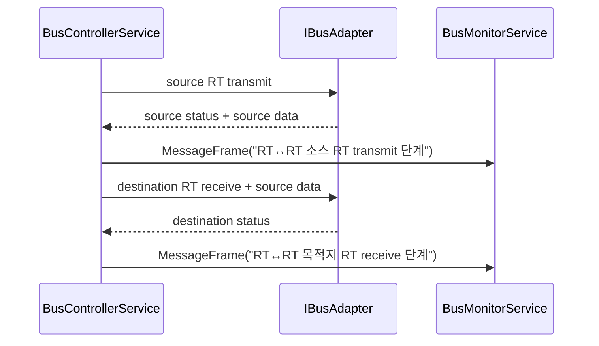

# 2026-04-18_RTtoRT-fidelity_설계검토

## 1. 배경

- 현재 RT ↔ RT 전송 자체는 동작하지만, telemetry fidelity는 아직 얕았다.
- 특히 receive 계열 `MessageFrame`은 `TransferResult.dataWords`만 사용해, BC -> RT와 RT ↔ RT 목적지 단계에서 실제 bus payload가 비어 보일 수 있었다.
- RT ↔ RT도 두 단계가 모두 `메시지 프레임`으로만 남아 source / destination 구분이 약했다.

## 2. 목표

- receive 계열 telemetry가 실제 bus payload를 보존하도록 만든다.
- RT ↔ RT source / destination 단계를 description과 time-tag 순서로 분리해 trace를 읽기 쉽게 만든다.
- 이 범위를 native / Host end-to-end 테스트로 고정한다.

## 3. 범위

- `src/native/Application/BusControllerService`
- `src/native/Domain/TransferTypes`
- `tests/native/NativeTests.cpp`
- `tests/dotnet/MilStd1553.Host.Tests/NativeHarnessClientEndToEndTests.cs`
- 관련 테스트 결과 / 상태 문서

## 4. 제외 범위

- 새로운 시나리오 JSON 스키마 추가
- RT ↔ RT 전용 세션 스케줄 타입 추가
- intermessage gap, command / status 세부 timing 모델 추가
- 실제 벤더 SDK binding

## 5. 용어 정의

| 용어 | 의미 |
| --- | --- |
| receive 계열 payload | BC가 RT로 보내는 regular receive 또는 with-data Mode Code에 실리는 데이터 워드 |
| RT ↔ RT source 단계 | source RT가 transmit 응답을 돌려주는 첫 번째 단계 |
| RT ↔ RT destination 단계 | destination RT가 receive로 payload를 저장하는 두 번째 단계 |

## 6. 요구사항

1. `MessageFrame` telemetry는 실제 버스에 실린 데이터 워드를 보여야 한다.
2. transmit 계열은 `TransferResult.dataWords`, receive 계열은 `TransferRequest.dataWords`를 사용한다.
3. RT ↔ RT는 source / destination 두 개의 `MessageFrame` 이벤트를 남겨야 한다.
4. RT ↔ RT 두 이벤트는 순서가 보장되어야 하고, description으로 단계를 구분할 수 있어야 한다.
5. Mode Code command는 RT ↔ RT 요청으로 허용하지 않는다.
6. C ABI / Host DTO 경계에서도 receive payload가 그대로 유지되어야 한다.

## 7. 책임 분리

### 7.1 C++ 책임

- `BusControllerService`가 receive / transmit 계열별 telemetry payload 선택을 담당한다.
- RT ↔ RT source / destination 단계 description은 native application 계층에서 결정한다.
- Mode Code RT ↔ RT 거부 규칙은 native application 계층에서 판단한다.

### 7.2 C# 책임

- Host / Interop는 기존 DTO shape를 유지한 채 payload가 보존되는지만 검증한다.
- 새로운 의미 해석은 추가하지 않고 기존 `TelemetryEventRecord`를 그대로 사용한다.

## 8. 레이어 영향도

| 레이어 | 영향 |
| --- | --- |
| Domain | `TelemetryEvent::CreateMessageEvent`가 선택적 description을 받는다. |
| Application | `BusControllerService`가 telemetry payload 선택과 RT ↔ RT stage description을 담당한다. |
| Infrastructure | 변경 없음 |
| Host / Interop | receive payload가 end-to-end로 유지되는지 smoke test만 강화한다. |

## 9. 클래스 / 인터페이스 설계 초안

| 대상 | 변경 |
| --- | --- |
| `BusControllerService::ExecuteCore` | 공통 전송 경로를 description과 함께 수행한다. |
| `BusControllerService::PublishMessageEvent` | description과 실제 frame data word를 함께 선택한다. |
| `BusControllerService::ResolveFrameDataWords` | transmit / receive 계열별 실제 bus payload를 선택한다. |
| `TelemetryEvent::CreateMessageEvent` | 기본 설명을 유지하면서 caller가 stage description을 넘길 수 있게 확장한다. |

## 10. 데이터 흐름 / 시퀀스

추가 규칙:

- destination `MessageFrame.dataWords`는 destination `TransferResult.dataWords`가 아니라 request payload를 사용한다.
- BC -> RT receive regular transfer도 같은 규칙을 따른다.

## 11. 테스트 전략

- Red
  - BC -> RT receive telemetry가 payload를 잃지 않는지 확인하는 실패 테스트를 추가한다.
  - RT ↔ RT telemetry가 source / destination description과 ordered time-tag를 남기는지 실패 테스트를 추가한다.
  - Mode Code RT ↔ RT 요청이 거부되는지 실패 테스트를 추가한다.
  - Host end-to-end receive scenario에서 telemetry payload가 살아 있는지 실패 테스트를 추가한다.
- Green
  - `BusControllerService` 공통 전송 경로를 `ExecuteCore`로 묶고 최소 구현으로 통과시킨다.
- Refactor
  - payload 선택 규칙을 `ResolveFrameDataWords`로 분리해 전송 종류별 조건을 한곳에 모은다.

## 12. 리스크 및 대응

| 리스크 | 영향 | 대응 |
| --- | --- | --- |
| receive / transmit 데이터 선택 규칙을 잘못 섞는 경우 | telemetry가 실제 bus frame과 달라진다. | regular receive, regular transmit, RT ↔ RT destination을 각각 테스트로 고정한다. |
| RT ↔ RT description만 늘리고 timing 의미가 과장되는 경우 | 실제 물리 fidelity와 문서가 혼동될 수 있다. | 이번 범위는 payload / stage visibility까지만 다루고, timing 확장은 backlog로 분리한다. |

## 13. 완료 기준

- native 3종 테스트가 추가된다.
  - BC -> RT receive payload 보존
  - RT ↔ RT source / destination telemetry 단계 구분
  - Mode Code RT ↔ RT 거부
- Host end-to-end receive smoke test가 추가된다.
- 테스트 결과 문서와 상태 문서가 최신화된다.
