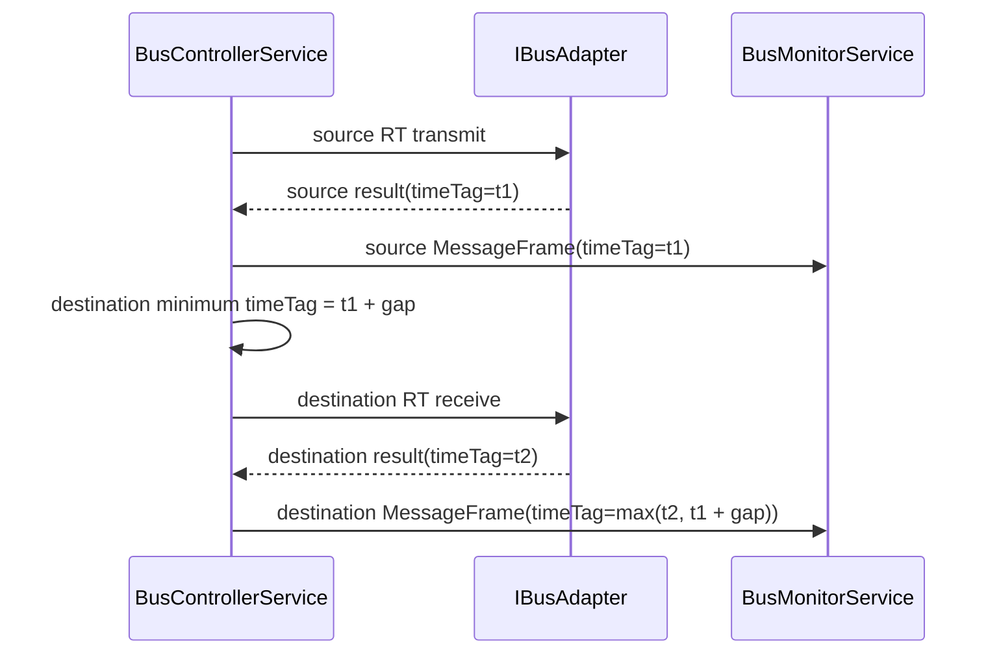

# 2026-04-18_RTtoRT-timing-fidelity_설계검토
## 1. 배경

- 현재 RT ↔ RT 흐름은 source / destination 단계 구분과 payload 보존까지는 끝났다.
- 하지만 time-tag는 어댑터가 돌려주는 단순 증가값에만 의존해서, 두 단계 사이의 intermessage gap 의미가 설계와 테스트에 고정돼 있지 않다.
- 이 상태에서는 replay나 BM trace를 볼 때 "순서만 다르고 timing 의미는 비어 있는" 로그가 남는다.

## 2. 목표

- RT ↔ RT source 단계와 destination 단계 사이에 시뮬레이터용 최소 intermessage gap 규칙을 둔다.
- 이 규칙이 `MessageFrame` telemetry와 `RtToRtTransferResult` 양쪽에 같은 time-tag로 반영되도록 고정한다.
- BC → RT, RT → BC, Mode Code, Host DTO shape는 그대로 둔다.

## 3. 범위

- `src/native/Application/BusControllerService`
- `tests/native/NativeTests.cpp`
- 관련 설계 / 테스트 / 상태 문서

## 4. 제외 범위

- 실제 MIL-STD-1553B 물리 계층 정밀 timing 모사
- command / status gap의 전체 규격화
- `.NET` Host DTO나 JSON schema 변경
- 실제 장비 벤더 SDK binding

## 5. 용어 정의

| 용어 | 의미 |
| --- | --- |
| source 단계 | RT ↔ RT에서 source RT가 transmit로 응답하는 첫 단계 |
| destination 단계 | source payload를 destination RT가 receive로 수신하는 둘째 단계 |
| 최소 gap | source 단계 완료 시각 이후 destination 단계 완료 시각이 최소한으로 벌어져야 하는 시뮬레이터 규칙 |

## 6. 요구사항

1. `ExecuteRtToRtTransfer`는 source 단계 성공 후 destination 단계에 최소 time-tag gap을 적용한다.
2. gap 적용 결과는 `RtToRtTransferResult.destinationTransfer.timeTag`와 telemetry `MessageFrame.timeTag`에 동일하게 보인다.
3. 기존 source 단계 time-tag는 유지한다.
4. 기존 BC → RT / RT → BC 실행 경로는 영향을 받지 않는다.
5. 실패한 destination 단계에는 성공 telemetry를 남기지 않는다.

## 7. 책임 분리

### 7.1 C++

- `BusControllerService`가 RT ↔ RT용 최소 gap 정책을 가진다.
- gap 적용은 application 계층에서만 처리하고, simulator adapter의 기본 time-tag tick 규칙은 그대로 둔다.

### 7.2 C#

- Host는 기존 telemetry DTO를 그대로 사용한다.
- 이번 범위에서는 새로운 C# 구현 없이 전체 회귀만 확인한다.

## 8. 레이어 영향도

| 레이어 | 영향 |
| --- | --- |
| Domain | 변경 없음 |
| Application | RT ↔ RT 목적지 단계 time-tag 보정 로직 추가 |
| Infrastructure | 변경 없음 |
| Host / Interop | 스키마 변경 없음, 회귀 검증만 수행 |

## 9. 클래스 / 인터페이스 설계 초안

- `BusControllerService::ExecuteCore`
  - 성공 결과의 최종 time-tag를 결정할 수 있도록 `minimumTimeTag` 선택 인자를 받는다.
- `BusControllerService::ExecuteRtToRtTransfer`
  - source 단계의 최종 time-tag에 `RT ↔ RT 최소 gap`을 더해 destination 단계 최소 시각을 계산한다.

## 10. 데이터 흐름

## 11. 테스트 전략

- Red
  - RT ↔ RT destination event가 단순히 source보다 큰 값이 아니라, 설계에서 정한 최소 gap 이상인지 검증하는 실패 테스트를 추가한다.
  - 같은 값이 `destinationTransfer.timeTag`와 `destination MessageFrame.timeTag`에 동시에 반영되는지 검증한다.
- Green
  - `ExecuteCore` 성공 경로에서 최종 time-tag를 한 곳에서 결정하도록 최소 구현한다.
- Refactor
  - gap 계산과 성공 결과 time-tag 정규화를 분리해 중복을 줄인다.

## 12. 리스크 및 대응

| 리스크 | 영향 | 대응 |
| --- | --- | --- |
| gap 값을 규격 timing처럼 오해할 수 있다. | 문서가 실제 물리 규격처럼 읽힐 수 있다. | 문서에 "시뮬레이터용 최소 gap"이라고 명시하고, 실제 물리 정밀 모사는 제외 범위로 둔다. |
| 성공 결과 time-tag 정규화가 기존 경로를 흔들 수 있다. | 다른 성공 경로 테스트가 깨질 수 있다. | 전체 native / .NET 회귀를 같이 돌려 영향 범위를 확인한다. |

## 13. 완료 기준

- RT ↔ RT 목적지 단계가 최소 gap 이상 벌어진 time-tag로 기록된다.
- `destinationTransfer.timeTag`와 destination telemetry frame time-tag가 일치한다.
- native 전체 테스트와 .NET 전체 테스트가 통과한다.
