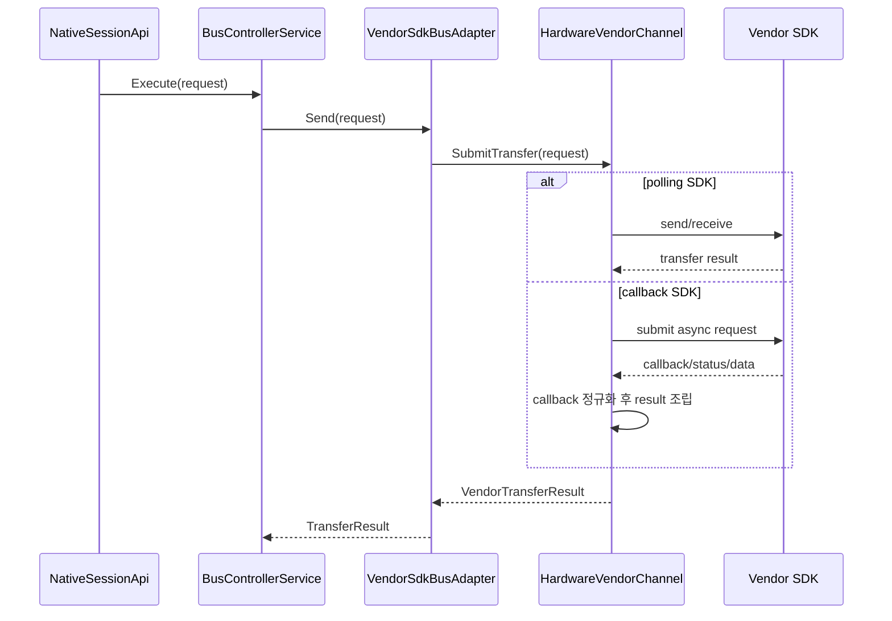
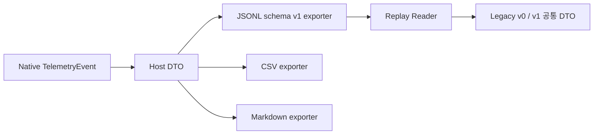

# 2026-04-18_잔여확장설계_설계검토

## 1. 배경

- 전체 하네스 MVP, mock CLI example, RT ↔ RT 최소 gap baseline까지의 구현은 이미 닫혀 있다.
- 하지만 상태 문서 기준으로는 다음 5가지가 설계상 후속 항목으로 남아 있었다.
  - 실장비 벤더 SDK `IVendorChannel` binding 방식
  - RT ↔ RT deeper physical timing / command-status sequence fidelity
  - Mode Code 확장 우선순위
  - replay / report schema versioning과 richer presentation 방향
  - rich UI 필요 시 Presentation 기준
- 이 항목들은 서로 연결돼 있어서 개별 메모 수준으로 남겨두면 이후 구현 순서와 책임 경계가 다시 흔들릴 수 있다.

## 2. 목표

- 남아 있던 확장 설계를 하나의 기준선으로 정리해 더 이상 “설계가 덜 닫혀서 구현을 못 한다”는 상태를 남기지 않는다.
- 외부 입력이 필요한 항목과 저장소 내부에서 바로 구현 가능한 항목을 명확히 분리한다.
- 기존 MVP 구조를 유지한 채 후속 구현이 어느 레이어에서 어떤 형태로 들어가야 하는지 고정한다.

## 3. 범위

- `IVendorChannel` 기반 실장비 binding 상세 설계
- RT ↔ RT 물리 시퀀스 고도화 방향
- Mode Code 확장 우선순위와 묶음 기준
- BM replay / report schema versioning 기준
- CLI 이후 Presentation 방향 결정
- 관련 상태 문서와 의사결정 기록 갱신

## 4. 제외 범위

- 실제 벤더 SDK concrete 구현
- C++ / C# 프로덕션 코드 변경
- 새로운 테스트 코드 추가
- 실제 하드웨어 연동 검증

## 5. 용어 정의

| 용어 | 의미 |
| --- | --- |
| 실장비 binding | 실제 1553 카드 SDK를 현재 `IVendorChannel` 경계 아래에 붙이는 작업 |
| callback 정규화 | callback 기반 SDK를 `SubmitTransfer` 중심의 동기 결과 모델로 내부에서 감싸는 방식 |
| schema v1 | JSONL telemetry / report line에 `schemaVersion`과 stable envelope를 명시한 첫 버전 |
| 1차 Mode Code 묶음 | 외부 입력 없이도 구현 가능한 다음 우선순위 Mode Code 집합 |
| rich UI | CLI보다 풍부한 운영용 Presentation 계층. 현재 범위에서는 선택 사항이다. |

## 6. 요구사항

### 6.1 실장비 벤더 SDK binding

1. `IVendorChannel`은 계속 `open / close / submit transfer / select bus / capability query`의 최소 계약으로 유지한다.
2. 실장비 concrete 구현은 벤더 handle 수명주기를 클래스 내부에서 RAII로 소유한다.
3. callback 기반 SDK라도 `VendorSdkBusAdapter` 위로 callback을 노출하지 않고, concrete `IVendorChannel` 내부에서 bounded queue 또는 wait primitive로 정규화한다.
4. timeout, retry, 자동 failover의 정책 책임은 계속 `Application`에 둔다. 하드웨어 assist는 capability 힌트로만 사용한다.
5. 첫 실장비 binding은 현재 `NativeSessionApi -> VendorSdkBusAdapter -> IVendorChannel` 경로를 그대로 재사용한다.
6. 첫 실장비 binding 범위에는 raw BM callback / interrupt 수집 계약을 넣지 않는다. 현재 BM은 `BusControllerService`가 생성한 telemetry를 `BusMonitorService`에 기록하는 기준선을 유지한다.
7. raw BM frame을 직접 수집해야 하는 시점이 오면, 이는 `IVendorChannel` 확장이 아니라 별도의 optional Infrastructure 계약으로 추가한다.

### 6.2 RT ↔ RT deeper physical timing

1. 현재의 “destination 최소 `40us` gap” baseline은 유지한다.
2. 더 깊은 fidelity는 `BusControllerService`에 조건문을 누적하는 방식이 아니라 별도 시퀀스 모델로 분리한다.
3. 다음 단계의 RT ↔ RT trace는 최소한 아래 단계를 명시적으로 표현할 수 있어야 한다.
   - 목적지 RT receive command 단계
   - 소스 RT transmit command 단계
   - 소스 RT status / data 응답 단계
   - 목적지 RT status 완료 단계
4. 세부 time-tag 계산 규칙은 전용 policy 객체에서 관리하고, `BusControllerService`는 orchestration만 담당한다.
5. Host DTO와 C ABI shape는 가능한 한 유지하고, richer trace가 필요하면 description / metadata 확장으로 우선 해결한다.

### 6.3 Mode Code 확장 우선순위

1. Mode Code 확장은 “요청이 들어올 때마다 한 개씩”이 아니라 tranche 단위로 추가한다.
2. 외부 입력 없이 바로 진행할 수 있는 1차 Mode Code 묶음은 아래 4종으로 고정한다.
   - `Reset Remote Terminal`
   - `Transmit Last Command Word`
   - `Inhibit Terminal Flag`
   - `Override Inhibit Terminal Flag`
3. 2차 Mode Code 묶음은 운영 제어와 broadcast 민감성이 큰 항목으로 분리한다.
   - `Dynamic Bus Control`
   - 추가 broadcast / terminal-control 계열 Mode Code
4. 1차와 2차 사이의 구현 경계는 테스트와 문서에서 명확히 분리한다.
5. 정의된 tranche 밖의 Mode Code는 계속 `UnsupportedModeCode`로 유지한다.

### 6.4 replay / report schema versioning

1. JSONL은 계속 canonical persisted source로 유지한다.
2. CSV / Markdown은 canonical 저장 포맷이 아니라 projection output으로 유지한다.
3. 다음 구현 시 JSONL summary / event line에는 공통 envelope를 추가한다.
   - `schemaVersion`
   - `recordType`
   - `sessionId`
   - `sequence`
4. replay reader는 `schemaVersion`이 없는 기존 line을 legacy `v0`로 해석해 계속 읽을 수 있어야 한다.
5. schema migration 책임은 Host exporter / replay reader에 두고, native telemetry DTO 의미는 유지한다.

### 6.5 Presentation 방향

1. canonical operator entry point는 계속 `MilStd1553.Cli`로 유지한다.
2. rich UI가 필요해지면 첫 GUI baseline은 `WPF`로 시작한다.
3. `WinUI`는 첫 GUI baseline에서 제외한다.
4. GUI는 `MilStd1553.Host`와 `MilStd1553.Interop` 위에 얇은 Presentation 계층으로만 추가한다.
5. GUI가 추가돼도 packaging과 mock example의 canonical onboarding 경로는 CLI를 유지한다.

## 7. 책임 분리

### 7.1 C++

- `IVendorChannel` concrete 구현, callback 정규화, vendor error mapping은 `Infrastructure`
- RT ↔ RT 시퀀스 planner / timing policy는 `Application`
- Mode Code 의미 모델과 기본 분류는 `Domain`
- 세션 facade와 실장비 / 시뮬레이터 교체 지점은 `Interop`

### 7.2 C#

- schema versioning을 가진 exporter / replay reader는 `Host`
- GUI가 생겨도 `Host` / `Interop`를 재사용하고, Presentation은 조립과 표시만 담당한다.
- CLI는 계속 canonical 운영 진입점으로 남는다.

## 8. 레이어 영향도

| 레이어 | 영향 |
| --- | --- |
| Domain | Mode Code tranche 분리 기준과 지원 범위 명세 추가 |
| Application | RT ↔ RT 시퀀스 planner / timing policy 분리 방향 고정 |
| Infrastructure | 실장비 `IVendorChannel` binding 규칙과 callback 정규화 원칙 고정 |
| Interop | 현재 session facade 유지, 실장비 binding 교체 지점만 확정 |
| Host | schema versioning, legacy replay compatibility, projection output 규칙 고정 |
| Presentation | CLI canonical 유지, 필요 시 WPF 추가라는 방향 결정 |

## 9. 클래스 / 인터페이스 설계 초안

| 이름 | 레이어 | 역할 | 상태 |
| --- | --- | --- | --- |
| `HardwareVendorChannel` | Infrastructure | 실제 카드 SDK를 `IVendorChannel`로 감싼 concrete 구현 | 후속 구현 |
| `VendorSdkCallbackPump` | Infrastructure | callback 기반 SDK를 bounded queue / wait 방식으로 정규화하는 private helper | 필요 시 내부 helper |
| `RtToRtSequencePlanner` | Application | RT ↔ RT command / status 단계와 time-tag 계산 규칙을 분리 | 후속 구현 |
| `RtToRtTimingPolicy` | Application | 최소 gap, 단계 간 지연, richer trace 정책을 계산 | 후속 구현 |
| `ModeCodeExecutionCatalog` | Domain / Application | tranche별 Mode Code 지원 목록과 처리 분기를 모으는 기준점 | 후속 구현 |
| `TelemetrySchemaAdapterV1` | Host | legacy v0 JSONL과 v1 envelope를 변환 / 해석 | 후속 구현 |
| `MilStd1553.WpfShell` | Presentation | 필요 시 추가할 첫 GUI baseline | 선택적 후속 구현 |

## 10. 데이터 흐름 / 시퀀스

### 10.1 실장비 binding 정규화

### 10.2 replay / report schema 기준

## 11. 테스트 전략

### 11.1 Red

- `HardwareVendorChannel`이 callback 기반과 polling 기반 SDK를 같은 `VendorTransferResult`로 정규화하는 실패 테스트를 작성한다.
- `RtToRtSequencePlanner`가 목적지 command / 소스 command / 소스 status-data / 목적지 status의 순서를 지키는 실패 테스트를 작성한다.
- 1차 Mode Code 4종 각각에 대해 정상 / 미지원 / broadcast 민감 경계 테스트를 작성한다.
- replay reader가 `schemaVersion` 없는 legacy line과 `schemaVersion=1` line을 모두 읽는 실패 테스트를 작성한다.
- future WPF shell이 Host 서비스만 사용하고 native / SDK를 직접 참조하지 않는 구조 테스트를 추가한다.

### 11.2 Green

- 한 번에 모든 확장을 넣지 않고 `1차 Mode Code 묶음 -> schema v1 -> RT ↔ RT planner -> 하드웨어 binding` 순서로 나눠 최소 구현한다.
- 실장비 binding 전까지는 simulator / mock example 회귀가 계속 녹색이어야 한다.

### 11.3 Refactor

- callback 정규화 helper는 concrete `IVendorChannel` 내부에만 두고 Application으로 새 의존성을 올리지 않는다.
- RT ↔ RT timing 계산은 `BusControllerService`에서 분리해 별도 planner / policy로 이동한다.
- exporter와 replay reader의 versioning 분기는 DTO 의미 모델이 아니라 adapter 계층에서 처리한다.

## 12. 리스크 및 대응

| 리스크 | 영향 | 대응 |
| --- | --- | --- |
| `IVendorChannel`에 BM raw event까지 억지로 넣는 경우 | 첫 실장비 binding이 과도하게 커지고 구조가 흔들린다. | 첫 binding은 transfer / bus select 중심으로 제한하고, raw BM tap은 별도 optional 계약으로 미룬다. |
| RT ↔ RT fidelity를 기존 서비스에 누적하는 경우 | `BusControllerService`가 다시 비대해진다. | planner / policy 분리 원칙을 먼저 고정한다. |
| Mode Code 확장이 우선순위 없이 흩어지는 경우 | 테스트와 문서가 다시 일관성을 잃는다. | tranche 단위로 우선순위를 고정한다. |
| schema versioning을 너무 늦게 넣는 경우 | replay 호환성 관리 비용이 급격히 커진다. | 다음 Host 쪽 후속 구현에서 v1 envelope를 우선 도입한다. |
| GUI 방향을 늦게 결정하는 경우 | packaging, README, Host 책임이 다시 흔들린다. | CLI canonical 유지와 WPF 우선 방향을 지금 고정한다. |

## 13. 완료 기준

- 남아 있던 설계 항목이 문서, 상태 파일, 결정 기록으로 모두 닫혀 있다.
- 외부 입력이 없더라도 저장소 내부에서 실행 가능한 다음 구현 순서가 정해져 있다.
- 실장비 binding, Mode Code 확장, replay/report schema, RT ↔ RT 고도화, GUI 방향이 서로 충돌하지 않는다.
- 현재 구조를 깨지 않고 후속 구현이 어느 레이어에서 이루어져야 하는지 명확하다.
