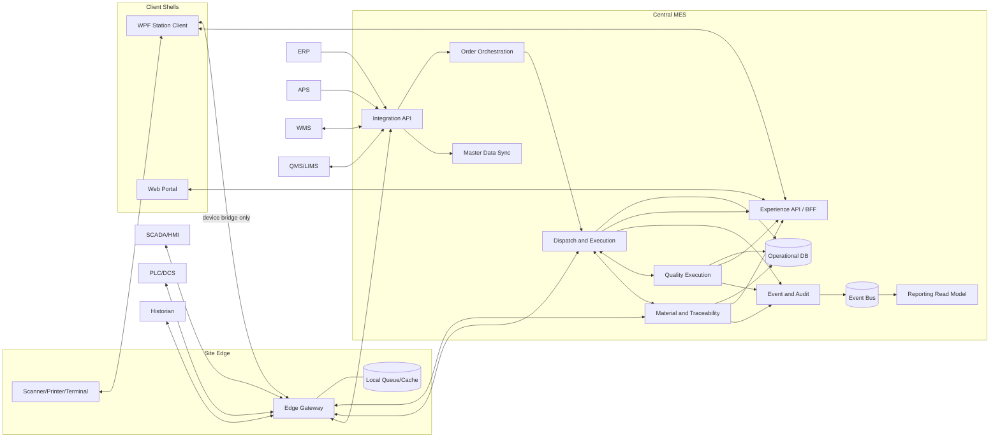
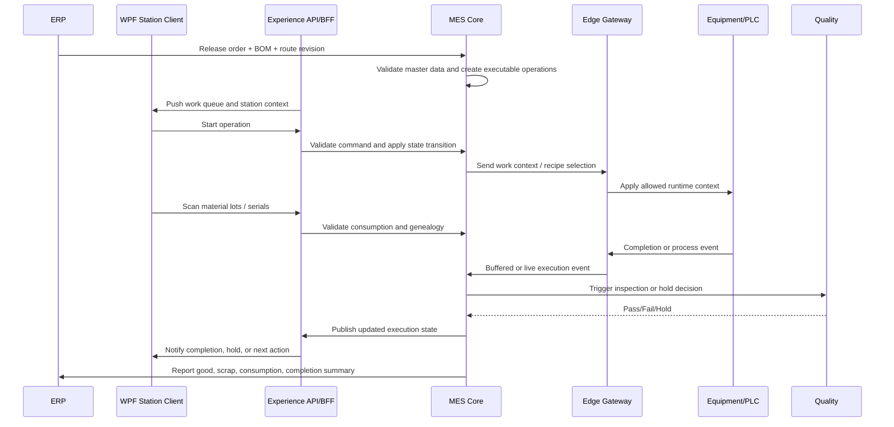

# MES Architecture Blueprint

## 1. 목적

이 문서는 MES 프로젝트의 초기 큰틀을 정의한다. 목표는 구현 전에 다음을 명확히 고정하는 것이다.

- MES가 실제로 소유해야 하는 책임
- ERP, APS, WMS, QMS, LIMS, SCADA, PLC와의 경계
- 1차 구축 범위와 이후 확장 경로
- 실행 데이터, 추적성, 품질, 예외 처리의 기본 모델

## 2. 기본 가정

현재 사용자 요구가 상세하지 않으므로 아래를 기본 가정으로 둔다.

- Brownfield 공장 기준으로 설계한다.
- 1개 사이트를 먼저 구축하되 multi-site 확장이 가능해야 한다.
- 생산 형태는 discrete 중심이되 batch 성격을 일부 수용할 수 있는 hybrid 구조를 택한다.
- ERP는 이미 존재하며 생산오더, 품목, BOM, Routing의 상위 마스터 소스 역할을 유지한다.
- MES는 현장 실행, WIP 상태, genealogy, line-side material execution, quality execution의 authoritative system이 된다.
- 현장은 항상 온라인이 아닐 수 있으므로 site edge와 store-and-forward가 필요하다.
- 작업자는 station PC 또는 tablet, barcode scanner, label printer를 사용한다.
- 현장 operator client는 Windows 환경일 가능성이 높으므로 WPF client를 1급 옵션으로 둔다.
- 관리/감시/조회 화면은 web client로도 동일한 backend contract를 사용할 수 있게 설계한다.

## 3. 설계 원칙

- 하나의 상태 전이는 하나의 시스템만 authoritative owner가 된다.
- MES는 dashboard보다 execution truth를 먼저 만든다.
- 화면 단위가 아니라 business responsibility 단위로 모듈을 나눈다.
- 업무 상태를 바꾸는 command path는 채널과 무관하게 하나로 고정한다.
- PLC와 SCADA는 제어를 담당하고, MES는 실행 컨텍스트와 business workflow를 담당한다.
- duplicate event, late event, offline sync를 기본 시나리오로 가정한다.
- release 1은 scheduling optimization보다 execution discipline과 traceability 확보에 집중한다.

## 4. 시스템 경계

| 시스템 | 주 책임 | MES와의 경계 |
|---|---|---|
| ERP | 생산오더 생성, item/BOM/routing master, 재무/출하/원가 | MES는 released order 이후의 execution state와 actual result를 관리 |
| APS | 중기 스케줄링, finite sequencing | MES는 실제 시작/완료/지연/제약 상태를 APS에 피드백 |
| WMS | 창고 재고, 입출고, bin 관리, replenishment | MES는 line-side consumption과 in-process material truth를 관리 |
| QMS | CAPA, complaint, enterprise quality process | MES는 현장 검사 실행, NCR trigger, hold/release event를 관리 |
| LIMS | 시험실 샘플과 실험 결과 | MES는 lab gate가 필요한 생산 단계와 disposition 연계를 관리 |
| SCADA/HMI | 설비 모니터링, alarm, supervisory control | MES는 생산 컨텍스트, 작업 지시, quality/traceability rule을 제공 |
| PLC/DCS | deterministic machine control | MES는 직접 제어 로직을 소유하지 않음 |
| Historian | high-frequency time-series 저장 | MES는 실행 상태와 business event를 소유하며 raw telemetry 저장소 역할은 피함 |

## 5. 타겟 아키텍처

### 5.1 논리 계층

1. Enterprise Integration Layer
2. Central MES Core Layer
3. Experience API / BFF Layer
4. Site Edge Integration Layer
5. Client Shell Layer
6. Data and Analytics Layer

### 5.2 핵심 모듈

| 모듈 | 책임 | 주요 엔티티 |
|---|---|---|
| Master Data Sync | ERP/WMS/QMS에서 필요한 마스터를 정제하고 버전 관리 | Item, BOM, Routing, Resource, Work Center, Spec |
| Order Orchestration | released order를 executable work로 변환하고 dispatch 후보를 만든다 | Production Order, Operation, Dispatch Queue |
| Dispatch and Execution | 작업 시작, 일시정지, 완료, 재작업, partial completion을 관리 | Operation Execution, WIP Unit, Work Instruction |
| Material and Traceability | 투입, 대체, consumption, genealogy, lot/serial 추적 | Material Lot, Serial, Consumption Record, Genealogy Link |
| Quality Execution | 검사 계획, 결과, hold/release, NCR trigger를 처리 | Inspection Plan, Result, Defect, Hold, NCR Trigger |
| Resource and Equipment Gate | 설비, 공구, 작업자 자격, recipe eligibility를 검증 | Equipment, Tool, Skill, Certification, Recipe Version |
| Event and Audit | domain event, audit trail, operator override, e-signature를 기록 | Domain Event, Audit Log, Override Record |
| Integration API | 외부 시스템과의 API, message contract, idempotency 처리 | Sync Job, Integration Contract, Event Envelope |
| Experience API / BFF | WPF/Web client가 공통 workflow contract로 MES를 사용하도록 task-oriented command/query API를 제공하며 업무 명령의 유일한 진입점이 된다 | Work Queue View, Action Command, Session Context, Notification |
| Reporting Read Model | OEE, WIP, genealogy search, exception dashboard용 조회 모델 | KPI Snapshot, Event Projection |
| Site Edge Gateway | 설비 인터페이스, protocol adapter, offline queue, store-and-forward를 담당하되 업무 상태의 authoritative owner가 되지 않는다 | Device Session, Buffered Event, Ack State |

### 5.3 권장 구현 스타일

- 시작 단계는 modular monolith + asynchronous integration 조합을 권장한다.
- 이유는 MES 도메인 경계가 초기에는 많이 바뀌고, 지나친 microservice 분리는 운영 복잡도만 키우기 쉽기 때문이다.
- 단, Site Edge Gateway는 central MES와 분리 배포한다.
- 향후 분리가 필요한 후보는 `Quality Execution`, `Reporting Read Model`, `Integration API` 순으로 본다.

### 5.4 Client architecture policy

- Domain rule, state transition, authorization rule, audit requirement는 client에 두지 않고 MES core와 application layer에 둔다.
- WPF와 Web은 같은 domain contract를 직접 공유하기보다 `Experience API / BFF`를 통해 task-oriented contract를 사용한다.
- Shop-floor operator flow는 WPF를 우선 허용한다. 이유는 scanner, printer, serial device, kiosk mode, Windows peripheral control, offline UX가 더 안정적이기 때문이다.
- Supervisor, quality review, dispatch board, genealogy search, dashboard, master-data administration은 web client를 우선 허용한다.
- Browser만으로 장비 제어나 안정적인 주변기기 제어가 어려운 경우, web client가 아니라 WPF station client 또는 별도 local bridge를 사용한다.
- 동일한 use case를 WPF와 Web 둘 다 제공해야 할 때도 business workflow 정의는 하나만 유지하고, 표현 계층만 분기한다.
- WPF가 `Edge`와 직접 통신할 수 있는 경우는 scanner, printer, local bridge, equipment handshake 같은 device-facing 작업으로 제한한다.

### 5.5 Recommended client split

| Client shell | Primary users | Best fit | Avoid when |
|---|---|---|---|
| WPF Station Client | Operator, line leader, station supervisor | scan-heavy work, label printing, kiosk, rich device access, intermittent network tolerance | lightweight dashboard or pure back-office use only |
| Web Portal | planner, production manager, quality engineer, warehouse coordinator, management | broad reach, easy deployment, dashboard, exception review, admin workflow | hard real-time peripheral workflow or strict local hardware integration |

### 5.6 Shared client contract rules

- Use task-based commands such as `start-operation`, `record-consumption`, `complete-operation`, `place-hold`, `release-hold`.
- Push work queue, alerts, and state changes through real-time notification channels where possible.
- Keep screen composition and temporary UI state in the client, but keep execution truth on the server.
- Standardize one permission model and one terminology set across WPF and Web.
- Treat offline queue replay, duplicate submission prevention, and session recovery as first-class client requirements.
- Correlate every client command and every device-originated event with a server-recognizable command or event ID.

### 5.7 Command ownership and edge boundary

- `WPF`와 `Web`의 모든 business command는 `Experience API / BFF`를 통해서만 MES core에 들어간다.
- `Edge`는 equipment event 수집, protocol translation, local buffering, device session 관리를 담당한다.
- `Edge`는 생산오더 상태, hold release, override approval, ERP posting 같은 business authority를 직접 확정하지 않는다.
- `WPF -> Edge` 직접 경로는 device bridge 또는 local peripheral access 용도에 한정한다.
- `Web -> Edge` 직접 경로는 허용하지 않는다.
- 오프라인 중 `WPF`가 임시 적재한 command라도 서버 재접속 후 `BFF/MES core` 검증을 통과해야만 authoritative state change로 승격된다.

### 5.8 Role-based channel matrix

| Workflow | Primary role | Preferred channel | Notes |
|---|---|---|---|
| 작업 시작/중지/완료 | Operator | WPF-first | scanner, kiosk, offline tolerance가 중요 |
| 자재 스캔/투입/소모 | Operator | WPF-first | peripheral control과 빠른 피드백 필요 |
| 라벨 출력/재출력 | Operator, line leader | WPF-first | printer and local device dependency |
| 설비 응답/ack 기반 진행 | Operator, equipment-facing station | WPF-first | edge와의 device handshake 필요 |
| dispatch board 조회 | Supervisor, planner | Web-first | 다중 사용자 조회와 배포 편의성 우선 |
| 품질 이력 조회와 예외 모니터링 | Quality, supervisor | Web-first | cross-line visibility가 중요 |
| genealogy search | Quality, warehouse, support | Web-first | 조회와 탐색 중심 |
| 관리자 설정/마스터 조회 | Admin, planner | Web-first | broad reach가 중요 |
| 단순 조회성 work queue | Operator, supervisor | Shared | 업무 semantics는 동일하게 유지 |

## 6. 배포 토폴로지

## 7. 핵심 실행 흐름

### 7.1 생산 실행 기본 흐름

### 7.2 예외 흐름 원칙

- duplicate completion event는 idempotency key로 무조건 중복 제거한다.
- master data revision mismatch가 있으면 시작 전에 차단한다.
- site connectivity loss 시 station은 offline mode를 표시하고 queue 적재 후 재전송한다.
- manual override는 supervisor 승인과 audit trail 없이는 허용하지 않는다.
- quality hold 상태의 WIP는 명시적으로 release되기 전까지 다음 공정으로 이동할 수 없다.

### 7.3 Client channel rules

- 동일한 작업 지시는 WPF와 Web에서 같은 action semantics를 가져야 한다.
- operator-critical flow는 WPF를 기준 채널로 정의하고, web은 보조 또는 조회 채널로 시작해도 된다.
- web에서 제공하는 기능이더라도 결과적으로는 same server command와 same audit log를 남겨야 한다.
- WPF local cache가 있더라도 local truth를 authoritative source로 취급하지 않는다.
- barcode scan, label print, device ack가 핵심인 공정은 WPF 우선 배치가 자연스럽다.

### 7.4 Offline authority matrix

| Action | Offline allowed | Notes |
|---|---|---|
| 작업 조회, queue 확인 | Yes | 마지막 동기화 시점과 offline 상태를 명확히 표시 |
| 작업 시작/중지 | Conditional | 유효 세션, local queue, 재전송 규칙이 있을 때만 허용 |
| 자재 스캔/소모 기록 | Conditional | provisional record로 적재하고 서버 검증 후 확정 |
| 작업 완료 기록 | Conditional | 설비 증적 또는 필수 입력이 확보된 경우에만 local queue 적재 |
| 품질 hold 설정 | Yes | 안전 측면에서 보수적으로 허용, 서버 복구 후 즉시 동기화 |
| 품질 hold release | No | supervisor approval과 authoritative audit 필요 |
| manual override 승인 | No | 중앙 권한, 감사 추적, 경우에 따라 e-signature 필요 |
| ERP posting, order close | No | 중앙 시스템 연동과 정합성 검증 필요 |
| master data 변경 | No | 버전 관리와 권한 통제가 필요 |

- 오프라인 허용 action도 서버 재연결 후 `duplicate check`, `revision check`, `authorization re-check`를 거쳐야 최종 확정된다.
- 오프라인 적재 실패나 재전송 충돌은 operator에게 숨기지 않고 명시적으로 보여준다.

### 7.5 Release 1 line-side inventory and reconciliation

- Release 1에서는 `WMS-lite` 정산 모델을 사용한다.
- warehouse stock authority는 `WMS`에 두고, line-side staging 및 in-process consumption truth는 `MES`에 둔다.
- `MES`는 material issue/consumption/return event를 기준으로 line-side 상태를 관리한다.
- `WMS`와의 정산은 최소한 아래 둘 중 하나를 가져야 한다.
  - event-based issue/return sync
  - shift-end 또는 일정 주기의 scheduled reconciliation
- Release 1에서 full warehouse redesign은 하지 않되, discrepancy 발견 시 누가 어떤 순서로 조정하는지 운영 규칙은 문서화해야 한다.
- product release나 shortage 대응에 영향을 주는 재고 차이는 예외 큐에서 명시적으로 관리한다.

### 7.6 Release 1 quality authority

- Release 1에서는 `MES`가 in-process quality execution과 hold gate authority를 가진다.
- 즉, 공정 진행을 막는 `hold`, 공정 내 `release`, 현장 검사 결과 기록, NCR trigger는 `MES` 기준으로 관리한다.
- `QMS/LIMS`는 enterprise quality workflow, CAPA, complaint, lab process, 장기 품질 기록을 담당한다.
- 최종 enterprise disposition이 별도 시스템에 남아야 하더라도, shop-floor 다음 공정 진행 여부는 Release 1에서는 `MES`가 authoritative하게 판단한다.
- 단, regulated environment라면 e-signature와 record retention 요구사항을 상세 설계에서 별도 검토해야 한다.

## 8. Canonical Domain Model

| 객체 | 키 식별자 | 대표 상태 | 비고 |
|---|---|---|---|
| Production Order | Order No | Released, Dispatched, In Progress, Partially Completed, Completed, Closed, Cancelled | 생성은 ERP, 실행 상태는 MES |
| Operation Execution | Order No + Operation Seq + Execution Id | Ready, Queued, Running, Hold, Rework, Done, Aborted | 현장 작업의 최소 실행 단위 |
| WIP Unit | Serial/Lot/Batch/WIP Id | Queued, In Process, Hold, Rework, Scrapped, Completed | discrete와 batch 모두 수용 가능해야 함 |
| Material Lot | Lot/Serial Id | Available, Issued, Consumed, Returned, Blocked | line-side truth는 MES 우선 |
| Genealogy Link | Parent-Child Link Id | Created, Finalized, Reversed | reversal 정책 필요 |
| Quality Record | Inspection Id | Pending, In Inspection, Passed, Failed, Hold, Released | QMS/LIMS 연계 가능 |
| Equipment Resource | Equipment Id | Available, Setup, Running, Down, Maintenance, Blocked | 제어 소유는 PLC/SCADA |
| Operator Action | Action Id | Requested, Approved, Rejected, Applied | override와 e-signature 포함 가능 |

## 9. Release Scope

### Release 1

- ERP 연계 기반 생산오더 수신
- 작업지시 dispatch
- 작업 시작/완료/중지/재작업
- barcode 기반 material issue/consumption
- 기본 genealogy 추적
- quality hold/release
- 생산실적과 scrap ERP 회신
- WPF station client + edge buffering
- web supervisor portal의 최소 조회/예외 모니터링
- `BFF` 기반 단일 command path
- `WMS-lite` reconciliation
- `MES` 기준 in-process quality authority

### Release 2

- WMS 연계 강화
- inspection plan 고도화
- equipment/resource eligibility
- downtime reason/OEE 기초 지표
- label, packing, pallet genealogy 확장
- web workflow 확장: quality review, dispatch board, admin screens

### Release 3

- multi-site template
- APS feedback loop 고도화
- advanced scheduling constraint exposure
- richer analytics and optimization

## 10. 비기능 요구사항

- 모든 execution event는 재처리 가능한 idempotent contract를 가져야 한다.
- operator action과 override는 감사 추적 가능해야 한다.
- site-edge 연결 장애 시에도 최소 핵심 작업은 지속 가능해야 한다.
- 이벤트 시간은 device time이 아니라 server-normalized timestamp 전략을 가져야 한다.
- integration contract와 master data revision은 버전 관리되어야 한다.
- 조회성 KPI는 operational transaction과 분리된 read model에서 계산한다.
- client channel이 달라도 command semantics, audit format, permission model은 동일해야 한다.
- client-specific UI technology choice가 domain model이나 integration contract를 바꾸지 않아야 한다.
- offline mode에서 허용되는 작업과 금지되는 작업이 명확해야 하며 operator에게 가시화되어야 한다.

## 11. 초기 오픈 이슈

- 제품군별 genealogy depth를 serial, lot, hybrid 중 어디까지 요구하는지
- enterprise-level 품질 authority를 MES와 QMS/LIMS 중 어디까지 분리할지
- 제품군/라인별로 `WMS-lite`에서 full WMS sync로 언제 확장할지
- routing master의 최종 authority를 ERP에 둘지 MES에서 execution-specific override를 허용할지
- edge 장비 연계 프로토콜을 OPC UA, MQTT, vendor API 중 무엇으로 표준화할지
- operator 사용 범위를 WPF only로 둘지, 일부 공정을 web client까지 열지

## 12. 권장 다음 단계

1. 파일럿 라인 1개와 대표 제품군 1개를 선정한다.
2. Release 1 범위를 기준으로 canonical ID 체계와 command/event catalog를 확정한다.
3. station UI의 실제 operator workflow를 화면이 아니라 step/event 기준으로 모델링하고, WPF/Web 채널 분기 지점을 명시한다.
4. 파일럿 라인 기준 offline authority matrix와 WMS-lite reconciliation flow를 운영팀과 함께 검증한다.
5. 이후 상세 설계에서는 logical data model, API/event spec, station UX flow, client shell contract로 내려간다.

## 13. 상세 설계 문서

- 역할 및 채널 기준: `docs/mes/client-channel-matrix.md`
- Command/Event 기준선: `docs/mes/command-event-catalog.md`
