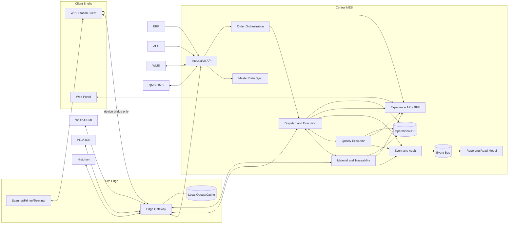
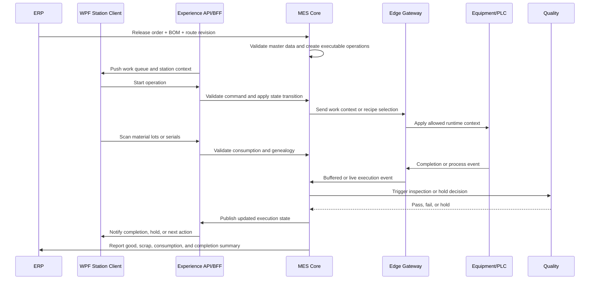

# MES Architecture Blueprint

## 1. 목적

이 문서는 현재 MES 프로젝트의 초기 아키텍처 경계와 Release 1 기준 책임 분리를 정의한다. 목표는 구현 전에 아래 항목을 명확하게 고정하는 것이다.

- MES가 실제로 authoritative owner가 되어야 하는 책임
- ERP, APS, WMS, QMS, LIMS, SCADA, PLC와의 경계
- 1차 구축 범위와 이후 확장 경로
- 실행 데이터, 추적성, 품질, 예외 처리의 기본 모델

## 2. 기본 가정

현재 사용자와 설비 정보가 완전히 확정된 상태가 아니므로, 아래를 작업 가정으로 둔다.

- Brownfield 공장을 전제로 설계한다.
- 먼저 단일 사이트와 단일 파일럿 라인을 기준으로 설계하되, 이후 multi-site 확장을 막지 않는 식별자와 계약을 유지한다.
- 생산 형태는 discrete 중심이지만 일부 batch 성격을 허용하는 hybrid 구조를 가정한다.
- ERP는 생산오더, 품목, BOM, Routing 같은 상위 마스터의 기본 authoritative source다.
- MES는 실행 상태, WIP, genealogy, line-side material execution, in-process quality의 authoritative system이다.
- 현장은 항상 완전한 온라인 상태가 아닐 수 있으므로 site edge와 store-and-forward가 필요하다.
- 작업자는 station PC 또는 tablet, barcode scanner, label printer를 사용한다.
- operator-critical flow는 WPF를 우선 채널로 두고, supervisory 및 management flow는 Web을 우선 채널로 둔다.
- 모든 business command는 공통 `Experience API / BFF`를 통해 MES core로 들어간다.
- 현재 실행 가능한 pilot profile의 working assumptions는 `docs/mes/pilot-profile-working-assumptions.md`에 정리되어 있으며, 실제 파일럿 라인이 확정되기 전까지는 그 문서를 기준으로 해석한다.

## 3. 설계 원칙

- 하나의 상태 전이와 하나의 business rule에는 하나의 authoritative owner만 둔다.
- MES는 dashboard보다 execution truth를 먼저 만든다.
- 모듈은 화면 단위가 아니라 business responsibility 단위로 나눈다.
- 작업 상태를 바꾸는 command path는 채널과 무관하게 하나로 고정한다.
- PLC와 SCADA는 설비 제어를 담당하고, MES는 실행 컨텍스트와 business workflow를 담당한다.
- duplicate event, late event, offline replay를 기본 시나리오로 가정한다.
- Release 1은 scheduling optimization보다 execution discipline, traceability, exception visibility를 우선한다.

## 4. 시스템 경계

| 시스템 | 주요 책임 | MES와의 경계 |
|---|---|---|
| ERP | 생산오더 생성, item/BOM/routing master, 재무 및 상위 계획 연계 | MES는 released order 이후의 execution state와 actual result를 관리한다. |
| APS | 중기 및 단기 생산계획, finite sequencing | MES는 실제 시작, 완료, 지연, 제약 상태를 APS에 피드백한다. |
| WMS | 창고 재고, 입출고, bin 관리, replenishment | MES는 line-side consumption과 in-process material truth를 관리한다. |
| QMS | CAPA, complaint, enterprise quality workflow | MES는 현장 검사, hold/release event, NCR trigger를 관리한다. |
| LIMS | 시험 의뢰, 샘플, 시험 결과 | MES는 lab gate가 필요한 생산 단계와 disposition 연계를 관리한다. |
| SCADA/HMI | 설비 모니터링, alarm, supervisory control | MES는 생산 컨텍스트, 작업 지시, quality와 traceability rule을 제공한다. |
| PLC/DCS | deterministic machine control | MES는 직접적인 machine control logic을 소유하지 않는다. |
| Historian | 고주기 시계열 저장 | MES는 business event와 execution state를 소유하고, raw telemetry 저장은 분리할 수 있다. |

## 5. 목표 아키텍처

### 5.1 논리 계층

1. Enterprise Integration Layer
2. Central MES Core Layer
3. Experience API / BFF Layer
4. Site Edge Integration Layer
5. Client Shell Layer
6. Data and Analytics Layer

### 5.2 핵심 모듈

| 모듈 | 책임 | 주요 엔티티 |
|---|---|---|
| Master Data Sync | ERP/WMS/QMS에서 필요한 마스터를 정제하고 버전을 관리한다. | Item, BOM, Routing, Resource, Work Center, Spec |
| Order Orchestration | released order를 executable work로 바꾸고 dispatch 후보를 만든다. | Production Order, Operation, Dispatch Queue |
| Dispatch and Execution | 작업 시작, 일시정지, 재개, 완료, partial completion을 관리한다. | Operation Execution, WIP Unit, Work Instruction |
| Material and Traceability | 자재 투입, 대체, consumption, genealogy를 관리한다. | Material Lot, Serial, Consumption Record, Genealogy Link |
| Quality Execution | 검사 계획, 검사 결과, hold/release, NCR trigger를 관리한다. | Inspection Plan, Result, Defect, Hold, NCR Trigger |
| Resource and Equipment Gate | 설비, 공구, 작업자 자격, recipe eligibility를 검증한다. | Equipment, Tool, Skill, Certification, Recipe Version |
| Event and Audit | domain event, audit trail, operator override, e-signature를 기록한다. | Domain Event, Audit Log, Override Record |
| Integration API | 외부 시스템과의 API, message contract, idempotency를 처리한다. | Sync Job, Integration Contract, Event Envelope |
| Experience API / BFF | WPF와 Web이 공통 workflow contract로 MES를 사용하도록 task-oriented command/query API를 제공한다. | Work Queue View, Action Command, Session Context, Notification |
| Reporting Read Model | OEE, WIP, genealogy search, exception dashboard 조회를 위한 read model을 제공한다. | KPI Snapshot, Event Projection |
| Site Edge Gateway | 설비 인터페이스, protocol adapter, offline queue, store-and-forward를 담당하되 business authority는 소유하지 않는다. | Device Session, Buffered Event, Ack State |

### 5.3 권장 구현 스타일

- 시작 단계는 modular monolith와 asynchronous integration 조합을 권장한다.
- 이유는 초기 MES는 경계가 계속 정제되기 때문에 성급한 microservice 분리가 운영 복잡도만 키우기 쉽기 때문이다.
- 단, Site Edge Gateway는 central MES와 분리 배포 가능한 경계로 둔다.
- 이후 분리가 필요해지면 `Quality Execution`, `Reporting Read Model`, `Integration API` 같은 안정된 책임을 기준으로 나눈다.

### 5.4 Client architecture policy

- domain rule, state transition, authorization rule, audit requirement는 client가 아니라 MES core와 application layer에 둔다.
- WPF와 Web은 같은 domain object를 직접 공유하기보다 `Experience API / BFF`를 통해 task-oriented contract를 사용한다.
- shop-floor operator flow는 WPF를 우선 채널로 둔다. scanner, printer, kiosk mode, Windows peripheral control, offline UX가 필요하기 때문이다.
- supervisor, quality review, dispatch board, genealogy search, dashboard, master-data administration은 Web을 우선 채널로 둔다.
- 브라우저만으로 설비 제어나 로컬 장치 의존 흐름을 안정적으로 처리하기 어려운 경우에는 Web이 아니라 WPF station client 또는 별도 local bridge를 사용한다.
- 동일한 use case를 WPF와 Web이 모두 제공하더라도 business workflow 정의는 하나만 유지하고, 표현 계층만 분리한다.
- WPF가 `Edge`와 직접 통신하는 경우는 scanner, printer, local bridge, equipment handshake 같은 device-facing 작업에 한정한다.

### 5.5 권장 client split

| Client shell | Primary users | Best fit | Avoid when |
|---|---|---|---|
| WPF Station Client | Operator, line leader, station supervisor | scan-heavy work, label printing, kiosk, rich device access, intermittent network tolerance | lightweight dashboard 또는 pure back-office use only |
| Web Portal | planner, production manager, quality engineer, warehouse coordinator, management | broad reach, easy deployment, dashboard, exception review, admin workflow | hard real-time peripheral workflow 또는 strict local hardware integration |

### 5.6 Shared client contract rules

- `start-operation`, `pause-operation`, `resume-operation`, `record-material-consumption`, `complete-operation`, `place-hold`, `release-hold` 같은 task-based command를 사용한다.
- work queue, alert, state change는 가능하면 실시간 notification 경로로도 밀어준다.
- 화면 구성과 임시 UI 상태는 client에 둘 수 있지만, execution truth는 서버가 가진다.
- permission model과 terminology는 WPF와 Web에서 동일하게 유지한다.
- offline replay, duplicate submission 방지, session recovery를 client 요구사항의 일부로 본다.
- client command와 device-originated event는 모두 서버가 인식할 수 있는 ID와 상관관계를 가져야 한다.

### 5.7 Command ownership and edge boundary

- `WPF`와 `Web`의 모든 business command는 `Experience API / BFF`를 통해서만 MES core로 들어간다.
- `Edge`는 equipment event 수집, protocol translation, local buffering, device session 관리를 담당한다.
- `Edge`가 생산오더 상태, hold release, override approval, ERP posting 같은 business authority를 직접 결정하지 않는다.
- `WPF -> Edge` direct path는 device bridge 또는 local peripheral access 용도로만 허용한다.
- `Web -> Edge` direct path는 허용하지 않는다.
- offline 중에 `WPF`가 임시로 적재한 command도 서버 재접속 후 `BFF/MES core` 검증을 통과해야 authoritative state change가 된다.

### 5.8 역할별 채널 매트릭스

| Workflow | Primary role | Preferred channel | Notes |
|---|---|---|---|
| 작업 시작, 중지, 완료 | Operator | WPF-first | scanner, kiosk, offline tolerance가 중요 |
| 자재 스캔, 투입, 소모 | Operator | WPF-first | peripheral control과 빠른 피드백이 필요 |
| 라벨 출력, 재출력 | Operator, line leader | WPF-first | printer 및 local device 의존 |
| 설비 응답 또는 ack 기반 진행 | Operator, equipment-facing station | WPF-first | edge와의 device handshake가 필요 |
| dispatch board 조회 | Supervisor, planner | Web-first | 다중 사용자 조회와 배포 편의가 우선 |
| 품질 이력 조회와 예외 모니터링 | Quality, supervisor | Web-first | cross-line visibility가 중요 |
| genealogy search | Quality, warehouse, support | Web-first | 조회와 탐색 중심 |
| 관리자 설정 및 마스터 검토 | Admin, planner | Web-first | broad reach가 중요 |
| 단순 조회형 work queue | Operator, supervisor | Shared | 업무 semantics는 동일하게 유지 |

## 6. 배포 토폴로지

## 7. 핵심 실행 흐름

### 7.1 생산 실행 기본 흐름

### 7.2 예외 흐름 정책

- duplicate completion event는 idempotency key로 중복 처리한다.
- master data revision mismatch가 있으면 작업 시작 전 차단한다.
- site connectivity loss 시 station은 offline mode와 pending replay 상태를 명확히 보여준다.
- manual override는 supervisor 승인과 audit trail 없이 허용하지 않는다.
- quality hold 상태의 WIP는 명시적으로 release되기 전까지 다음 공정으로 이동하지 못한다.

### 7.3 Client channel rules

- 동일한 작업 지시는 WPF와 Web에서 같은 action semantics를 가져야 한다.
- operator-critical flow는 WPF를 기본 채널로 정의하고, Web은 보조 또는 조회 채널로 시작한다.
- Web에서 제공하는 기능도 결과적으로는 같은 server command와 같은 audit log를 생성해야 한다.
- WPF local cache가 있더라도 local truth를 authoritative source로 취급하지 않는다.
- barcode scan, label print, device ack 같은 흐름은 WPF 우선 배치가 자연스럽다.

### 7.4 Offline authority matrix

| Action | Offline allowed | Notes |
|---|---|---|
| 작업 조회, queue 확인 | Yes | 마지막 동기화 시점과 offline 상태를 명확히 표시 |
| 작업 시작과 일시정지 | Conditional | 유효 session, local queue, 사전 정의된 규칙이 있을 때만 허용 |
| 자재 스캔 또는 소모 기록 | Conditional | provisional record로 적재하고 서버 검증 후 확정 |
| 작업 완료 기록 | Conditional | 설비 증적 또는 필수 입력이 확보된 경우에만 local queue 적재 |
| 품질 hold 설정 | Yes | 안전 측면에서 보수적으로 허용, 복구 즉시 동기화 |
| 품질 hold release | No | supervisor approval과 authoritative audit가 필요 |
| manual override 승인 | No | 중앙 권한, 감사 추적, 경우에 따라 e-signature 필요 |
| ERP posting, order close | No | 중앙 시스템 연동과 정합성 검증이 필요 |
| master data 변경 | No | 버전 관리와 권한 통제가 필요 |

- offline 허용 action도 서버 재연결 후 `duplicate check`, `revision check`, `authorization re-check`를 거쳐 최종 확정한다.
- offline 적재 실패나 사전 정의 충돌은 operator에게 숨기지 말고 명시적으로 보여준다.

### 7.5 Release 1 line-side inventory and reconciliation

- Release 1에서는 `WMS-lite` 정합 모델을 사용한다.
- warehouse stock authority는 `WMS`에 두고, line-side staging 및 in-process consumption truth는 `MES`에 둔다.
- `MES`는 material issue, consumption, return event를 기준으로 line-side 상태를 관리한다.
- `WMS`와의 정합은 아래 둘 중 하나 이상의 경로를 가져야 한다.
- event-based issue and return sync
- shift-end 또는 일정 주기의 scheduled reconciliation
- Release 1에서는 full warehouse redesign까지는 하지 않되, discrepancy 발견 시 어떤 순서로 조정할지 운영 규칙을 문서화해야 한다.
- product release에 영향을 주는 재고 차이는 예외 관리 대상으로 명시한다.

### 7.6 Release 1 quality authority

- Release 1에서는 `MES`가 in-process quality execution과 hold gate authority를 가진다.
- 공정 진행을 막는 `hold`, 공정용 `release`, 현장 검사 결과 기록, NCR trigger는 `MES` 기준으로 관리한다.
- `QMS/LIMS`는 enterprise quality workflow, CAPA, complaint, lab process, 장기 품질 이력을 담당한다.
- 최종 enterprise disposition이 별도 시스템에 있더라도, shop-floor 다음 공정 진행 여부는 Release 1에서 `MES`가 authoritative 하게 판단한다.
- regulated environment라면 e-signature와 record retention 요구사항은 상세 설계에서 별도 검토한다.

## 8. Canonical Domain Model

| 객체 | 기본 식별자 | 대표 상태 | 비고 |
|---|---|---|---|
| Production Order | Order No | Released, Dispatched, InProgress, PartiallyCompleted, Completed, Closed, Cancelled | 생성은 ERP, 실행 상태는 MES |
| Operation Execution | Order No + Operation Seq + Execution Id | Ready, Queued, Running, Paused, Hold, Rework, Done, Aborted | 현장 작업의 최소 실행 단위 |
| WIP Unit | Serial, Lot, Batch, WIP Id | Queued, InProcess, Hold, Rework, Scrapped, Completed | discrete와 batch를 모두 수용 가능 |
| Material Lot | Lot 또는 Serial Id | Available, Issued, Consumed, Returned, Blocked | line-side truth는 MES 기준 |
| Genealogy Link | Parent-Child Link Id | Created | 현재는 seed link 생성 중심, reversal과 finalization은 후속 과제 |
| Quality Record | Inspection Id | Pending, InInspection, Passed, Failed, Hold, Released | QMS/LIMS 연계 가정 포함 |
| Equipment Resource | Equipment Id | Available, Setup, Running, Down, Maintenance, Blocked | 제어 authority는 PLC 또는 SCADA |
| Override Request | Override Request Id | Requested, Approved, Rejected | 예외 승인용 canonical object |

- machine-facing document, payload spec, persistence draft는 `src/Mes.Domain`과 shared contract의 실행 가능한 spelling을 그대로 사용한다.
- 특히 `InProgress`, `PartiallyCompleted`, `InProcess`, `InInspection`, `Done` 같은 코드를 prose variant로 바꾸지 않는다.

## 9. Release Scope

### Release 1

- ERP 연계 기반 생산오더 수신
- 작업지시 dispatch
- 작업 시작, 완료, 중지, 재시작
- barcode 기반 material issue 및 consumption
- 기본 genealogy 추적
- quality hold와 release
- 생산실적과 scrap ERP 전송
- WPF station client와 edge buffering
- Web supervisor portal의 최소 조회와 예외 모니터링
- `BFF` 기반 단일 command path
- `WMS-lite` reconciliation
- `MES` 기준 in-process quality authority

### Release 2

- WMS 연계 강화
- inspection plan 고도화
- equipment 또는 resource eligibility
- downtime reason과 기본 OEE
- label, packing, pallet genealogy 확장
- Web workflow 확장: quality review, dispatch board, admin screens

### Release 3

- multi-site template
- APS feedback loop 고도화
- advanced analytics and optimization

## 10. 비기능 요구사항

- 모든 execution event는 사후 처리가 가능한 idempotent contract를 가져야 한다.
- operator action과 override는 감사 추적이 가능해야 한다.
- site-edge 연결 장애 시에도 최소 실행 작업과 지연 처리가 가능해야 한다.
- event timestamp는 device time이 아니라 server-normalized timestamp 기준을 가져야 한다.
- integration contract와 master data revision은 버전 관리되어야 한다.
- 조회와 KPI는 operational transaction과 분리된 read model에서 계산한다.
- client channel이 달라도 command semantics, audit format, permission model은 동일해야 한다.
- client-specific UI 기술 선택이 domain model이나 integration contract를 바꾸면 안 된다.
- offline mode에서 허용되는 작업과 금지되는 작업을 명확히 하고 operator에게 가시화해야 한다.

## 11. 초기 쟁점

- 아래 쟁점이 아직 확정되지 않았으므로, 현재 구현은 `docs/mes/pilot-profile-working-assumptions.md`의 working assumptions 위에서만 안전하게 해석해야 한다.
- 제품군별 genealogy depth를 serial, lot, hybrid 중 어디까지 요구하는지
- enterprise-level 품질 authority를 MES와 QMS/LIMS 중 어디까지 분리할지
- 제품군과 라인별 `WMS-lite`에서 full WMS sync로 언제 확장할지
- routing master의 최종 authority를 ERP가 유지할지, MES에서 execution-specific override를 허용할지
- edge 설비 연계 프로토콜을 OPC UA, MQTT, vendor API 중 무엇으로 표준화할지
- operator 사용 채널을 WPF only로 둘지, 일부 공정은 Web client까지 허용할지

## 12. 권장 다음 단계

1. 파일럿 라인 1개와 대표 제품군 1개를 고정한다.
2. Release 1 범위를 기준으로 canonical ID 체계와 command/event catalog를 확정한다.
3. station UI의 실제 operator workflow를 화면이 아니라 step/event 기준으로 모델링하고 WPF/Web 채널 분기 지점을 명시한다.
4. 파일럿 라인 기준 offline authority matrix와 WMS-lite reconciliation flow를 운영 관점에서 검증한다.
5. 이후 상세 설계에서는 logical data model, API/event spec, station UX flow, client shell contract로 내려간다.

## 13. 상세 설계 문서

- 채널 정책: `docs/mes/client-channel-matrix.md`
- Command/Event 정의: `docs/mes/command-event-catalog.md`
- Pilot profile working assumptions: `docs/mes/pilot-profile-working-assumptions.md`
- Pilot slice application design: `docs/mes/pilot-slice-01-application-design.md`
- BFF payload spec: `docs/mes/bff-payload-spec-slice-01.md`