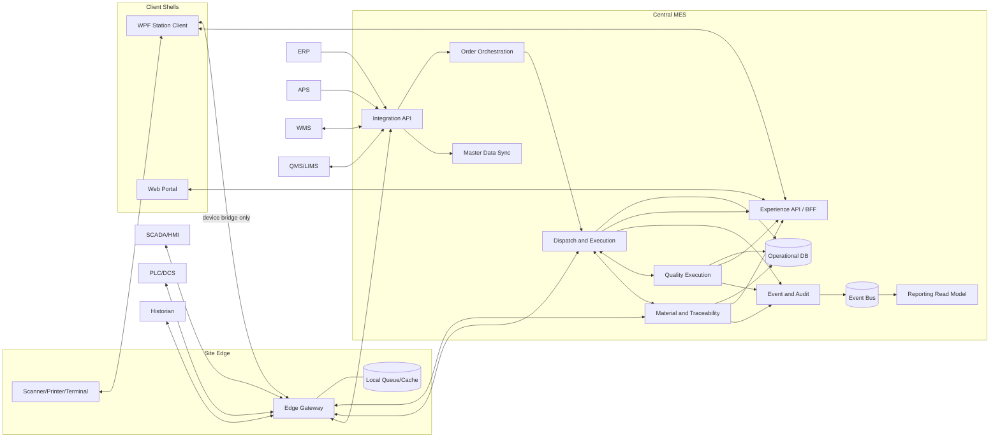
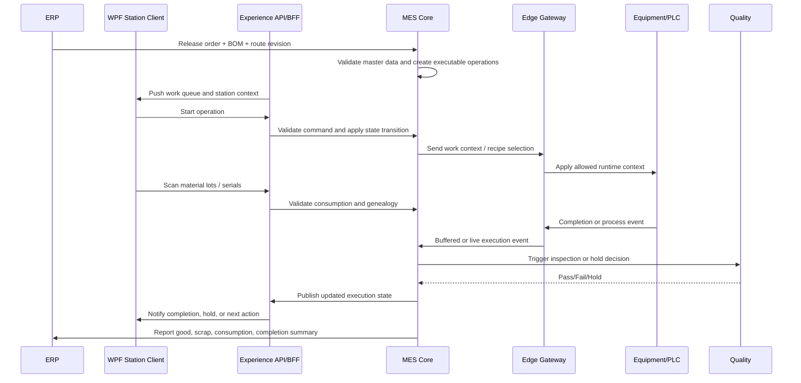

# MES Architecture Blueprint

## 1. 紐⑹쟻

??臾몄꽌??MES ?꾨줈?앺듃??珥덇린 ?고????뺤쓽?쒕떎. 紐⑺몴??援ы쁽 ?꾩뿉 ?ㅼ쓬??紐낇솗??怨좎젙?섎뒗 寃껋씠??

- MES媛€ ?ㅼ젣濡??뚯쑀?댁빞 ?섎뒗 梨낆엫
- ERP, APS, WMS, QMS, LIMS, SCADA, PLC?€??寃쎄퀎
- 1李?援ъ텞 踰붿쐞?€ ?댄썑 ?뺤옣 寃쎈줈
- ?ㅽ뻾 ?곗씠?? 異붿쟻?? ?덉쭏, ?덉쇅 泥섎━??湲곕낯 紐⑤뜽

## 2. 湲곕낯 媛€??
?꾩옱 ?ъ슜???붽뎄媛€ ?곸꽭?섏? ?딆쑝誘€濡??꾨옒瑜?湲곕낯 媛€?뺤쑝濡??붾떎.

- Brownfield 怨듭옣 湲곗??쇰줈 ?ㅺ퀎?쒕떎.
- 1媛??ъ씠?몃? 癒쇱? 援ъ텞?섎릺 multi-site ?뺤옣??媛€?ν빐???쒕떎.
- ?앹궛 ?뺥깭??discrete 以묒떖?대릺 batch ?깃꺽???쇰? ?섏슜?????덈뒗 hybrid 援ъ“瑜??앺븳??
- ERP???대? 議댁옱?섎ʼn ?앹궛?ㅻ뜑, ?덈ぉ, BOM, Routing???곸쐞 留덉뒪???뚯뒪 ??븷???좎??쒕떎.
- MES???꾩옣 ?ㅽ뻾, WIP ?곹깭, genealogy, line-side material execution, quality execution??authoritative system???쒕떎.
- ?꾩옣?€ ??긽 ?⑤씪?몄씠 ?꾨땺 ???덉쑝誘€濡?site edge?€ store-and-forward媛€ ?꾩슂?섎떎.
- ?묒뾽?먮뒗 station PC ?먮뒗 tablet, barcode scanner, label printer瑜??ъ슜?쒕떎.
- ?꾩옣 operator client??Windows ?섍꼍??媛€?μ꽦???믪쑝誘€濡?WPF client瑜?1湲??듭뀡?쇰줈 ?붾떎.
- 愿€由?媛먯떆/議고쉶 ?붾㈃?€ web client濡쒕룄 ?숈씪??backend contract瑜??ъ슜?????덇쾶 ?ㅺ퀎?쒕떎.
- ?꾩옱 executable pilot profile??working assumptions??`docs/mes/pilot-profile-working-assumptions.md`??蹂꾨룄濡?怨좎젙?섎ʼn, ?ㅼ젣 ?뚯씪???쇱씤 寃€利??꾧퉴吏€??洹?媛€?뺤쓣 湲곗??쇰줈 ?몃? ?ㅺ퀎瑜??뺣젹?쒕떎.

## 3. ?ㅺ퀎 ?먯튃

- ?섎굹???곹깭 ?꾩씠???섎굹???쒖뒪?쒕쭔 authoritative owner媛€ ?쒕떎.
- MES??dashboard蹂대떎 execution truth瑜?癒쇱? 留뚮뱺??
- ?붾㈃ ?⑥쐞媛€ ?꾨땲??business responsibility ?⑥쐞濡?紐⑤뱢???섎늿??
- ?낅Т ?곹깭瑜?諛붽씀??command path??梨꾨꼸怨?臾닿??섍쾶 ?섎굹濡?怨좎젙?쒕떎.
- PLC?€ SCADA???쒖뼱瑜??대떦?섍퀬, MES???ㅽ뻾 而⑦뀓?ㅽ듃?€ business workflow瑜??대떦?쒕떎.
- duplicate event, late event, offline sync瑜?湲곕낯 ?쒕굹由ъ삤濡?媛€?뺥븳??
- release 1?€ scheduling optimization蹂대떎 execution discipline怨?traceability ?뺣낫??吏묒쨷?쒕떎.

## 4. ?쒖뒪??寃쎄퀎

| ?쒖뒪??| 二?梨낆엫 | MES?€??寃쎄퀎 |
|---|---|---|
| ERP | ?앹궛?ㅻ뜑 ?앹꽦, item/BOM/routing master, ?щТ/異쒗븯/?먭? | MES??released order ?댄썑??execution state?€ actual result瑜?愿€由?|
| APS | 以묎린 ?ㅼ?以꾨쭅, finite sequencing | MES???ㅼ젣 ?쒖옉/?꾨즺/吏€???쒖빟 ?곹깭瑜?APS???쇰뱶諛?|
| WMS | 李쎄퀬 ?ш퀬, ?낆텧怨? bin 愿€由? replenishment | MES??line-side consumption怨?in-process material truth瑜?愿€由?|
| QMS | CAPA, complaint, enterprise quality process | MES???꾩옣 寃€???ㅽ뻾, NCR trigger, hold/release event瑜?愿€由?|
| LIMS | ?쒗뿕???섑뵆怨??ㅽ뿕 寃곌낵 | MES??lab gate媛€ ?꾩슂???앹궛 ?④퀎?€ disposition ?곌퀎瑜?愿€由?|
| SCADA/HMI | ?ㅻ퉬 紐⑤땲?곕쭅, alarm, supervisory control | MES???앹궛 而⑦뀓?ㅽ듃, ?묒뾽 吏€?? quality/traceability rule???쒓났 |
| PLC/DCS | deterministic machine control | MES??吏곸젒 ?쒖뼱 濡쒖쭅???뚯쑀?섏? ?딆쓬 |
| Historian | high-frequency time-series ?€??| MES???ㅽ뻾 ?곹깭?€ business event瑜??뚯쑀?섎ʼn raw telemetry ?€?μ냼 ??븷?€ ?쇳븿 |

## 5. ?€寃??꾪궎?띿쿂

### 5.1 ?쇰━ 怨꾩링

1. Enterprise Integration Layer
2. Central MES Core Layer
3. Experience API / BFF Layer
4. Site Edge Integration Layer
5. Client Shell Layer
6. Data and Analytics Layer

### 5.2 ?듭떖 紐⑤뱢

| 紐⑤뱢 | 梨낆엫 | 二쇱슂 ?뷀떚??|
|---|---|---|
| Master Data Sync | ERP/WMS/QMS?먯꽌 ?꾩슂??留덉뒪?곕? ?뺤젣?섍퀬 踰꾩쟾 愿€由?| Item, BOM, Routing, Resource, Work Center, Spec |
| Order Orchestration | released order瑜?executable work濡?蹂€?섑븯怨?dispatch ?꾨낫瑜?留뚮뱺??| Production Order, Operation, Dispatch Queue |
| Dispatch and Execution | ?묒뾽 ?쒖옉, ?쇱떆?뺤?, ?꾨즺, ?ъ옉?? partial completion??愿€由?| Operation Execution, WIP Unit, Work Instruction |
| Material and Traceability | ?ъ엯, ?€泥? consumption, genealogy, lot/serial 異붿쟻 | Material Lot, Serial, Consumption Record, Genealogy Link |
| Quality Execution | 寃€??怨꾪쉷, 寃곌낵, hold/release, NCR trigger瑜?泥섎━ | Inspection Plan, Result, Defect, Hold, NCR Trigger |
| Resource and Equipment Gate | ?ㅻ퉬, 怨듦뎄, ?묒뾽???먭꺽, recipe eligibility瑜?寃€利?| Equipment, Tool, Skill, Certification, Recipe Version |
| Event and Audit | domain event, audit trail, operator override, e-signature瑜?湲곕줉 | Domain Event, Audit Log, Override Record |
| Integration API | ?몃? ?쒖뒪?쒓낵??API, message contract, idempotency 泥섎━ | Sync Job, Integration Contract, Event Envelope |
| Experience API / BFF | WPF/Web client媛€ 怨듯넻 workflow contract濡?MES瑜??ъ슜?섎룄濡?task-oriented command/query API瑜??쒓났?섎ʼn ?낅Т 紐낅졊???좎씪??吏꾩엯?먯씠 ?쒕떎 | Work Queue View, Action Command, Session Context, Notification |
| Reporting Read Model | OEE, WIP, genealogy search, exception dashboard??議고쉶 紐⑤뜽 | KPI Snapshot, Event Projection |
| Site Edge Gateway | ?ㅻ퉬 ?명꽣?섏씠?? protocol adapter, offline queue, store-and-forward瑜??대떦?섎릺 ?낅Т ?곹깭??authoritative owner媛€ ?섏? ?딅뒗??| Device Session, Buffered Event, Ack State |

### 5.3 沅뚯옣 援ы쁽 ?ㅽ???
- ?쒖옉 ?④퀎??modular monolith + asynchronous integration 議고빀??沅뚯옣?쒕떎.
- ?댁쑀??MES ?꾨찓??寃쎄퀎媛€ 珥덇린?먮뒗 留롮씠 諛붾€뚭퀬, 吏€?섏튇 microservice 遺꾨━???댁쁺 蹂듭옟?꾨쭔 ?ㅼ슦湲??쎄린 ?뚮Ц?대떎.
- ?? Site Edge Gateway??central MES?€ 遺꾨━ 諛고룷?쒕떎.
- ?ν썑 遺꾨━媛€ ?꾩슂???꾨낫??`Quality Execution`, `Reporting Read Model`, `Integration API` ?쒖쑝濡?蹂몃떎.

### 5.4 Client architecture policy

- Domain rule, state transition, authorization rule, audit requirement??client???먯? ?딄퀬 MES core?€ application layer???붾떎.
- WPF?€ Web?€ 媛숈? domain contract瑜?吏곸젒 怨듭쑀?섍린蹂대떎 `Experience API / BFF`瑜??듯빐 task-oriented contract瑜??ъ슜?쒕떎.
- Shop-floor operator flow??WPF瑜??곗꽑 ?덉슜?쒕떎. ?댁쑀??scanner, printer, serial device, kiosk mode, Windows peripheral control, offline UX媛€ ???덉젙?곸씠湲??뚮Ц?대떎.
- Supervisor, quality review, dispatch board, genealogy search, dashboard, master-data administration?€ web client瑜??곗꽑 ?덉슜?쒕떎.
- Browser留뚯쑝濡??λ퉬 ?쒖뼱???덉젙?곸씤 二쇰?湲곌린 ?쒖뼱媛€ ?대젮??寃쎌슦, web client媛€ ?꾨땲??WPF station client ?먮뒗 蹂꾨룄 local bridge瑜??ъ슜?쒕떎.
- ?숈씪??use case瑜?WPF?€ Web ?????쒓났?댁빞 ???뚮룄 business workflow ?뺤쓽???섎굹留??좎??섍퀬, ?쒗쁽 怨꾩링留?遺꾧린?쒕떎.
- WPF媛€ `Edge`?€ 吏곸젒 ?듭떊?????덈뒗 寃쎌슦??scanner, printer, local bridge, equipment handshake 媛숈? device-facing ?묒뾽?쇰줈 ?쒗븳?쒕떎.

### 5.5 Recommended client split

| Client shell | Primary users | Best fit | Avoid when |
|---|---|---|---|
| WPF Station Client | Operator, line leader, station supervisor | scan-heavy work, label printing, kiosk, rich device access, intermittent network tolerance | lightweight dashboard or pure back-office use only |
| Web Portal | planner, production manager, quality engineer, warehouse coordinator, management | broad reach, easy deployment, dashboard, exception review, admin workflow | hard real-time peripheral workflow or strict local hardware integration |

### 5.6 Shared client contract rules

- Use task-based commands such as `start-operation`, `pause-operation`, `resume-operation`, `record-material-consumption`, `complete-operation`, `place-hold`, `release-hold`.
- Push work queue, alerts, and state changes through real-time notification channels where possible.
- Keep screen composition and temporary UI state in the client, but keep execution truth on the server.
- Standardize one permission model and one terminology set across WPF and Web.
- Treat offline queue replay, duplicate submission prevention, and session recovery as first-class client requirements.
- Correlate every client command and every device-originated event with a server-recognizable command or event ID.

### 5.7 Command ownership and edge boundary

- `WPF`?€ `Web`??紐⑤뱺 business command??`Experience API / BFF`瑜??듯빐?쒕쭔 MES core???ㅼ뼱媛꾨떎.
- `Edge`??equipment event ?섏쭛, protocol translation, local buffering, device session 愿€由щ? ?대떦?쒕떎.
- `Edge`???앹궛?ㅻ뜑 ?곹깭, hold release, override approval, ERP posting 媛숈? business authority瑜?吏곸젒 ?뺤젙?섏? ?딅뒗??
- `WPF -> Edge` 吏곸젒 寃쎈줈??device bridge ?먮뒗 local peripheral access ?⑸룄???쒖젙?쒕떎.
- `Web -> Edge` 吏곸젒 寃쎈줈???덉슜?섏? ?딅뒗??
- ?ㅽ봽?쇱씤 以?`WPF`媛€ ?꾩떆 ?곸옱??command?쇰룄 ?쒕쾭 ?ъ젒????`BFF/MES core` 寃€利앹쓣 ?듦낵?댁빞留?authoritative state change濡??밴꺽?쒕떎.

### 5.8 Role-based channel matrix

| Workflow | Primary role | Preferred channel | Notes |
|---|---|---|---|
| ?묒뾽 ?쒖옉/以묒?/?꾨즺 | Operator | WPF-first | scanner, kiosk, offline tolerance媛€ 以묒슂 |
| ?먯옱 ?ㅼ틪/?ъ엯/?뚮え | Operator | WPF-first | peripheral control怨?鍮좊Ⅸ ?쇰뱶諛??꾩슂 |
| ?쇰꺼 異쒕젰/?ъ텧??| Operator, line leader | WPF-first | printer and local device dependency |
| ?ㅻ퉬 ?묐떟/ack 湲곕컲 吏꾪뻾 | Operator, equipment-facing station | WPF-first | edge?€??device handshake ?꾩슂 |
| dispatch board 議고쉶 | Supervisor, planner | Web-first | ?ㅼ쨷 ?ъ슜??議고쉶?€ 諛고룷 ?몄쓽???곗꽑 |
| ?덉쭏 ?대젰 議고쉶?€ ?덉쇅 紐⑤땲?곕쭅 | Quality, supervisor | Web-first | cross-line visibility媛€ 以묒슂 |
| genealogy search | Quality, warehouse, support | Web-first | 議고쉶?€ ?먯깋 以묒떖 |
| 愿€由ъ옄 ?ㅼ젙/留덉뒪??議고쉶 | Admin, planner | Web-first | broad reach媛€ 以묒슂 |
| ?⑥닚 議고쉶??work queue | Operator, supervisor | Shared | ?낅Т semantics???숈씪?섍쾶 ?좎? |

## 6. 諛고룷 ?좏뤃濡쒖?

## 7. ?듭떖 ?ㅽ뻾 ?먮쫫

### 7.1 ?앹궛 ?ㅽ뻾 湲곕낯 ?먮쫫

### 7.2 ?덉쇅 ?먮쫫 ?먯튃

- duplicate completion event??idempotency key濡?臾댁“嫄?以묐났 ?쒓굅?쒕떎.
- master data revision mismatch媛€ ?덉쑝硫??쒖옉 ?꾩뿉 李⑤떒?쒕떎.
- site connectivity loss ??station?€ offline mode瑜??쒖떆?섍퀬 queue ?곸옱 ???ъ쟾?≫븳??
- manual override??supervisor ?뱀씤怨?audit trail ?놁씠???덉슜?섏? ?딅뒗??
- quality hold ?곹깭??WIP??紐낆떆?곸쑝濡?release?섍린 ?꾧퉴吏€ ?ㅼ쓬 怨듭젙?쇰줈 ?대룞?????녿떎.

### 7.3 Client channel rules

- ?숈씪???묒뾽 吏€?쒕뒗 WPF?€ Web?먯꽌 媛숈? action semantics瑜?媛€?몄빞 ?쒕떎.
- operator-critical flow??WPF瑜?湲곗? 梨꾨꼸濡??뺤쓽?섍퀬, web?€ 蹂댁“ ?먮뒗 議고쉶 梨꾨꼸濡??쒖옉?대룄 ?쒕떎.
- web?먯꽌 ?쒓났?섎뒗 湲곕뒫?대뜑?쇰룄 寃곌낵?곸쑝濡쒕뒗 same server command?€ same audit log瑜??④꺼???쒕떎.
- WPF local cache媛€ ?덈뜑?쇰룄 local truth瑜?authoritative source濡?痍④툒?섏? ?딅뒗??
- barcode scan, label print, device ack媛€ ?듭떖??怨듭젙?€ WPF ?곗꽑 諛곗튂媛€ ?먯뿰?ㅻ읇??

### 7.4 Offline authority matrix

| Action | Offline allowed | Notes |
|---|---|---|
| ?묒뾽 議고쉶, queue ?뺤씤 | Yes | 留덉?留??숆린???쒖젏怨?offline ?곹깭瑜?紐낇솗???쒖떆 |
| ?묒뾽 ?쒖옉/以묒? | Conditional | ?좏슚 ?몄뀡, local queue, ?ъ쟾??洹쒖튃???덉쓣 ?뚮쭔 ?덉슜 |
| ?먯옱 ?ㅼ틪/?뚮え 湲곕줉 | Conditional | provisional record濡??곸옱?섍퀬 ?쒕쾭 寃€利????뺤젙 |
| ?묒뾽 ?꾨즺 湲곕줉 | Conditional | ?ㅻ퉬 利앹쟻 ?먮뒗 ?꾩닔 ?낅젰???뺣낫??寃쎌슦?먮쭔 local queue ?곸옱 |
| ?덉쭏 hold ?ㅼ젙 | Yes | ?덉쟾 痢〓㈃?먯꽌 蹂댁닔?곸쑝濡??덉슜, ?쒕쾭 蹂듦뎄 ??利됱떆 ?숆린??|
| ?덉쭏 hold release | No | supervisor approval怨?authoritative audit ?꾩슂 |
| manual override ?뱀씤 | No | 以묒븰 沅뚰븳, 媛먯궗 異붿쟻, 寃쎌슦???곕씪 e-signature ?꾩슂 |
| ERP posting, order close | No | 以묒븰 ?쒖뒪???곕룞怨??뺥빀??寃€利??꾩슂 |
| master data 蹂€寃?| No | 踰꾩쟾 愿€由ъ? 沅뚰븳 ?듭젣媛€ ?꾩슂 |

- ?ㅽ봽?쇱씤 ?덉슜 action???쒕쾭 ?ъ뿰寃???`duplicate check`, `revision check`, `authorization re-check`瑜?嫄곗퀜??理쒖쥌 ?뺤젙?쒕떎.
- ?ㅽ봽?쇱씤 ?곸옱 ?ㅽ뙣???ъ쟾??異⑸룎?€ operator?먭쾶 ?④린吏€ ?딄퀬 紐낆떆?곸쑝濡?蹂댁뿬以€??

### 7.5 Release 1 line-side inventory and reconciliation

- Release 1?먯꽌??`WMS-lite` ?뺤궛 紐⑤뜽???ъ슜?쒕떎.
- warehouse stock authority??`WMS`???먭퀬, line-side staging 諛?in-process consumption truth??`MES`???붾떎.
- `MES`??material issue/consumption/return event瑜?湲곗??쇰줈 line-side ?곹깭瑜?愿€由ы븳??
- `WMS`?€???뺤궛?€ 理쒖냼???꾨옒 ??以??섎굹瑜?媛€?몄빞 ?쒕떎.
  - event-based issue/return sync
  - shift-end ?먮뒗 ?쇱젙 二쇨린??scheduled reconciliation
- Release 1?먯꽌 full warehouse redesign?€ ?섏? ?딅릺, discrepancy 諛쒓껄 ???꾧? ?대뼡 ?쒖꽌濡?議곗젙?섎뒗吏€ ?댁쁺 洹쒖튃?€ 臾몄꽌?뷀빐???쒕떎.
- product release??shortage ?€?묒뿉 ?곹뼢??二쇰뒗 ?ш퀬 李⑥씠???덉쇅 ?먯뿉??紐낆떆?곸쑝濡?愿€由ы븳??

### 7.6 Release 1 quality authority

- Release 1?먯꽌??`MES`媛€ in-process quality execution怨?hold gate authority瑜?媛€吏꾨떎.
- 利? 怨듭젙 吏꾪뻾??留됰뒗 `hold`, 怨듭젙 ??`release`, ?꾩옣 寃€??寃곌낵 湲곕줉, NCR trigger??`MES` 湲곗??쇰줈 愿€由ы븳??
- `QMS/LIMS`??enterprise quality workflow, CAPA, complaint, lab process, ?κ린 ?덉쭏 湲곕줉???대떦?쒕떎.
- 理쒖쥌 enterprise disposition??蹂꾨룄 ?쒖뒪?쒖뿉 ?⑥븘???섎뜑?쇰룄, shop-floor ?ㅼ쓬 怨듭젙 吏꾪뻾 ?щ???Release 1?먯꽌??`MES`媛€ authoritative?섍쾶 ?먮떒?쒕떎.
- ?? regulated environment?쇰㈃ e-signature?€ record retention ?붽뎄?ы빆???곸꽭 ?ㅺ퀎?먯꽌 蹂꾨룄 寃€?좏빐???쒕떎.

## 8. Canonical Domain Model

| 媛앹껜 | ???앸퀎??| ?€???곹깭 | 鍮꾧퀬 |
|---|---|---|---|
| Production Order | Order No | Released, Dispatched, InProgress, PartiallyCompleted, Completed, Closed, Cancelled | ?앹꽦?€ ERP, ?ㅽ뻾 ?곹깭??MES |
| Operation Execution | Order No + Operation Seq + Execution Id | Ready, Queued, Running, Paused, Hold, Rework, Done, Aborted | ?꾩옣 ?묒뾽??理쒖냼 ?ㅽ뻾 ?⑥쐞 |
| WIP Unit | Serial/Lot/Batch/WIP Id | Queued, InProcess, Hold, Rework, Scrapped, Completed | discrete?€ batch 紐⑤몢 ?섏슜 媛€?ν빐????|
| Material Lot | Lot/Serial Id | Available, Issued, Consumed, Returned, Blocked | line-side truth??MES ?곗꽑 |
| Genealogy Link | Parent-Child Link Id | Created | ?꾩옱 ?꾨찓??seed??link ?앹꽦留??곗꽑 紐⑤뜽留곹븯怨?reversal/finalization?€ ?꾩냽?쇰줈 誘몃８ |
| Quality Record | Inspection Id | Pending, InInspection, Passed, Failed, Hold, Released | QMS/LIMS ?곌퀎 媛€??|
| Equipment Resource | Equipment Id | Available, Setup, Running, Down, Maintenance, Blocked | ?쒖뼱 ?뚯쑀??PLC/SCADA |
| Override Request | Override Request Id | Requested, Approved, Rejected | ?꾩옱 ?덉쇅 ?뱀씤 ?먮쫫??canonical object, e-signature ?뺤옣?€ ?꾩냽 ?좏깮 ?ы빆 |

- Machine-facing documents, payload specs, and persistence drafts should reuse the exact executable code spellings from `src/Mes.Domain`.
- In particular, prefer `InProgress`, `PartiallyCompleted`, `InProcess`, `InInspection`, and `Done` instead of prose variants such as `In Progress`, `Partially Completed`, or `In Inspection`.

## 9. Release Scope

### Release 1

- ERP ?곌퀎 湲곕컲 ?앹궛?ㅻ뜑 ?섏떊
- ?묒뾽吏€??dispatch
- ?묒뾽 ?쒖옉/?꾨즺/以묒?/?ъ옉??- barcode 湲곕컲 material issue/consumption
- 湲곕낯 genealogy 異붿쟻
- quality hold/release
- ?앹궛?ㅼ쟻怨?scrap ERP ?뚯떊
- WPF station client + edge buffering
- web supervisor portal??理쒖냼 議고쉶/?덉쇅 紐⑤땲?곕쭅
- `BFF` 湲곕컲 ?⑥씪 command path
- `WMS-lite` reconciliation
- `MES` 湲곗? in-process quality authority

### Release 2

- WMS ?곌퀎 媛뺥솕
- inspection plan 怨좊룄??- equipment/resource eligibility
- downtime reason/OEE 湲곗큹 吏€??- label, packing, pallet genealogy ?뺤옣
- web workflow ?뺤옣: quality review, dispatch board, admin screens

### Release 3

- multi-site template
- APS feedback loop 怨좊룄??- advanced scheduling constraint exposure
- richer analytics and optimization

## 10. 鍮꾧린???붽뎄?ы빆

- 紐⑤뱺 execution event???ъ쿂由?媛€?ν븳 idempotent contract瑜?媛€?몄빞 ?쒕떎.
- operator action怨?override??媛먯궗 異붿쟻 媛€?ν빐???쒕떎.
- site-edge ?곌껐 ?μ븷 ?쒖뿉??理쒖냼 ?듭떖 ?묒뾽?€ 吏€??媛€?ν빐???쒕떎.
- ?대깽???쒓컙?€ device time???꾨땲??server-normalized timestamp ?꾨왂??媛€?몄빞 ?쒕떎.
- integration contract?€ master data revision?€ 踰꾩쟾 愿€由щ릺?댁빞 ?쒕떎.
- 議고쉶??KPI??operational transaction怨?遺꾨━??read model?먯꽌 怨꾩궛?쒕떎.
- client channel???щ씪??command semantics, audit format, permission model?€ ?숈씪?댁빞 ?쒕떎.
- client-specific UI technology choice媛€ domain model?대굹 integration contract瑜?諛붽씀吏€ ?딆븘???쒕떎.
- offline mode?먯꽌 ?덉슜?섎뒗 ?묒뾽怨?湲덉??섎뒗 ?묒뾽??紐낇솗?댁빞 ?섎ʼn operator?먭쾶 媛€?쒗솕?섏뼱???쒕떎.

## 11. 珥덇린 ?ㅽ뵂 ?댁뒋

- ?꾨옒 ?댁뒋?ㅼ? ?꾩쭅 ?몃? ?뺤젙???꾨땲硫? ?꾩옱 援ы쁽?€ `docs/mes/pilot-profile-working-assumptions.md`??working assumptions ?꾩뿉?쒕쭔 ?덉쟾?섍쾶 ?댁꽍?댁빞 ?쒕떎.
- ?쒗뭹援곕퀎 genealogy depth瑜?serial, lot, hybrid 以??대뵒源뚯? ?붽뎄?섎뒗吏€
- enterprise-level ?덉쭏 authority瑜?MES?€ QMS/LIMS 以??대뵒源뚯? 遺꾨━?좎?
- ?쒗뭹援??쇱씤蹂꾨줈 `WMS-lite`?먯꽌 full WMS sync濡??몄젣 ?뺤옣?좎?
- routing master??理쒖쥌 authority瑜?ERP???섏? MES?먯꽌 execution-specific override瑜??덉슜?좎?
- edge ?λ퉬 ?곌퀎 ?꾨줈?좎퐳??OPC UA, MQTT, vendor API 以?臾댁뾿?쇰줈 ?쒖??뷀븷吏€
- operator ?ъ슜 踰붿쐞瑜?WPF only濡??섏?, ?쇰? 怨듭젙??web client源뚯? ?댁?

## 12. 沅뚯옣 ?ㅼ쓬 ?④퀎

1. ?뚯씪???쇱씤 1媛쒖? ?€???쒗뭹援?1媛쒕? ?좎젙?쒕떎.
2. Release 1 踰붿쐞瑜?湲곗??쇰줈 canonical ID 泥닿퀎?€ command/event catalog瑜??뺤젙?쒕떎.
3. station UI???ㅼ젣 operator workflow瑜??붾㈃???꾨땲??step/event 湲곗??쇰줈 紐⑤뜽留곹븯怨? WPF/Web 梨꾨꼸 遺꾧린 吏€?먯쓣 紐낆떆?쒕떎.
4. ?뚯씪???쇱씤 湲곗? offline authority matrix?€ WMS-lite reconciliation flow瑜??댁쁺?€怨??④퍡 寃€利앺븳??
5. ?댄썑 ?곸꽭 ?ㅺ퀎?먯꽌??logical data model, API/event spec, station UX flow, client shell contract濡??대젮媛꾨떎.

## 13. ?곸꽭 ?ㅺ퀎 臾몄꽌

- ??븷 諛?梨꾨꼸 湲곗?: `docs/mes/client-channel-matrix.md`
- Command/Event 湲곗??? `docs/mes/command-event-catalog.md`

